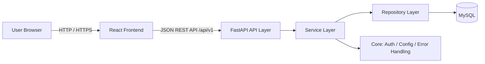
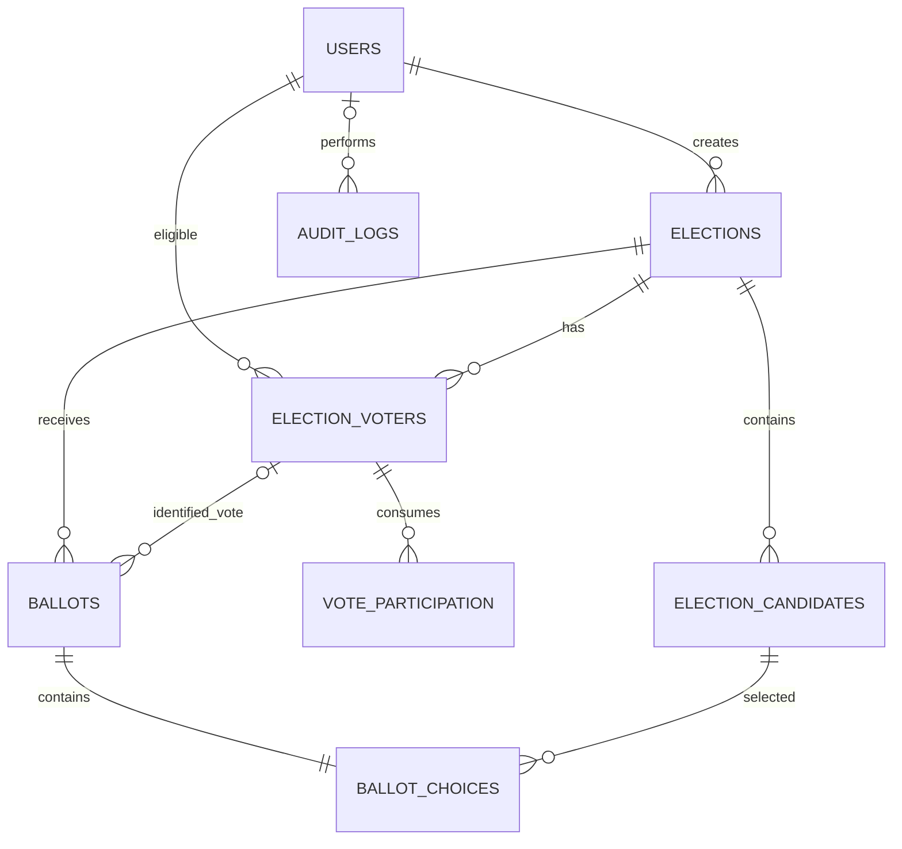
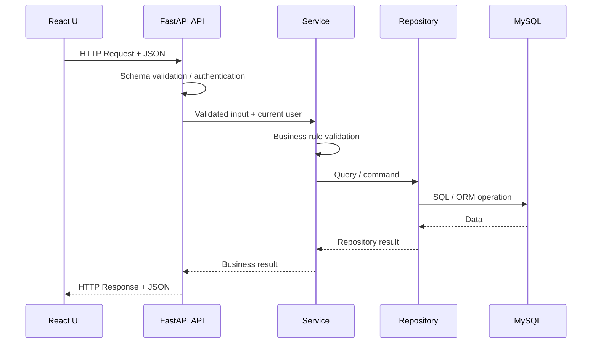
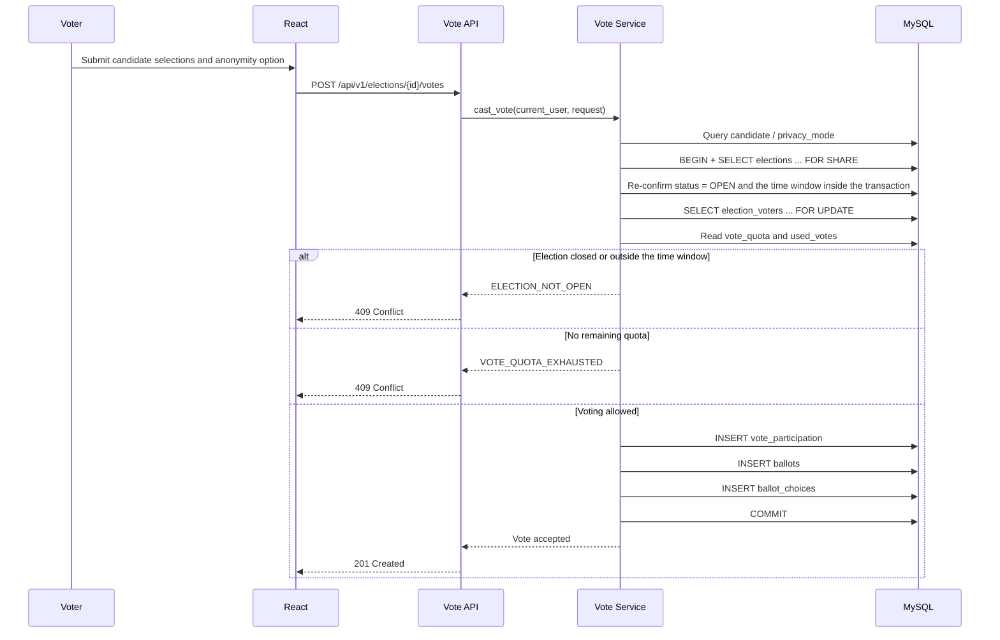

# Architecture Design

English / [简体中文](docs/architecture/ARCHITECTURE_CN.md)

---
> Architecture version: **v0.2**
> Requirements baseline: **SRS v0.1**
> Last updated: 2026-09-30
> Scope: COMP3500SEF group project · Election Management and Voting System · first MVP
>
> This document describes the overall technical design of the project, including the **system architecture, technology stack, module boundaries, frontend/backend layering, database design, key flows, security and privacy, and testing and deployment**.
>
> This document describes "why the system is organized this way and how the parts collaborate." Concrete API fields, the complete table-creation implementation, and test cases are maintained by the corresponding specialized documents or by the code, so that the same fact is not defined in multiple places.
>

---

## 1. Overall System Architecture

The entire system adopts a frontend/backend separation architecture consisting of a **React frontend + Python / FastAPI backend + MySQL database**. The browser communicates only with the backend REST API, and the frontend must not access the database directly.



The system is currently organized as a **Modular Monolith**: it is divided by business into modules such as identity, election, candidate, voter, voting, and result, but is still deployed and run as a single FastAPI application. At the current scale, there is no need to introduce microservices, message queues, or distributed databases.

## 2. Layering

### 2.1 Backend

The backend uses a three-layer architecture, consisting of:

- **API Layer**: Responsible for HTTP API, Request / Response, and input parameter parsing and format validation.
- **Service Layer**: Responsible for implementing specific business processes and business rules.
- **Repository / DAO Layer**: Responsible for interacting with the database.

> [!ERROR] **Note**
>
> Cross-layer access is strictly prohibited. For example, the API Layer must not access the database directly; likewise, it is also forbidden to implement logic in one layer that should belong to another layer.

#### 2.1.1 Data Validation Across Backend Layers

Data validation is divided into the following three parts according to responsibility:

1. **API Layer: Format Validation**

   The API Layer is responsible for checking whether external input is valid in terms of data format, for example:

   - Whether required fields are missing;
   - Whether data types are correct;
   - Whether fields such as dates and times can be parsed properly;
   - Whether numeric values exceed the allowed range;
   - Whether string lengths, enum values, etc. satisfy the interface contract.

   This type of validation is in principle performed by FastAPI / Pydantic Schema.

2. **Service Layer: Business Rule Validation**

   The Service Layer is responsible for checking whether data and operations comply with the system's business rules, for example:

   - Whether the current time is still within the voting time range;
   - Whether the user is eligible to vote in the election;
   - Whether the user still has remaining vote quota;
   - Whether the candidate belongs to the current election;
   - Whether the current election status allows the operation to be performed;
   - Whether the submitted ballot satisfies the business rules.

   If the Service Layer can be invoked in ways that bypass the HTTP API, for example when internal programs, background tasks, or external scripts call the Service directly, then the Service Layer must ensure that its own business contract holds and must re-validate the necessary input conditions; it must not rely on the API Layer as the sole protection.

3. **Repository / DAO Layer: Data Integrity and Security**

   The Repository / DAO Layer is not responsible for business rule validation; it is only responsible for performing data queries, writes, updates, and deletions.

   Database access must use an ORM or parameterized queries; constructing SQL through string concatenation is forbidden, in order to avoid database attacks such as SQL Injection.

   In addition, the database should use constraints such as `NOT NULL`, `UNIQUE`, `FOREIGN KEY`, and `CHECK` to guarantee final data integrity. For critical rules such as vote quota, foreign key relationships, and anonymous field consistency, database constraints, transactions, and locks should be used together wherever possible to provide the last line of protection.

### 2.2 Frontend

The frontend uses a five-layer architecture, consisting of:

- **Route Layer**: Responsible for the mapping between URLs and pages, as well as page navigation and basic route protection.
- **Page Layer**: Responsible for page layout, component composition, and page-level state coordination.
- **Component Layer**: Responsible for rendering the specific UI and handling user interaction.
- **Hook / Store Layer**: Responsible for frontend business processes, state management, shared state, and data processing.
- **Data Access Layer (API Layer)**: Responsible for HTTP communication with the backend API.

> [!ERROR] **Note**
>
> Cross-layer access is prohibited in principle. For example, the Page Layer and Component Layer must not send HTTP requests directly; all backend communication must be performed uniformly through the Data Access Layer.
>
> Likewise, it is also forbidden to implement logic in one layer that should belong to another layer. For example, the Component Layer must not implement complete business processes, and the Data Access Layer must not implement business rules.

#### 2.2.1 Responsibilities of Each Frontend Layer

1. **Route Layer: Page Navigation**

   The Route Layer is responsible for:

   - Mapping between URLs and pages;
   - Page navigation (redirects);
   - Basic route protection such as login state;
   - Handling of invalid paths.

   The Route Layer is only responsible for frontend navigation control and does not serve as the final basis for system permission control.

2. **Page Layer: Page Organization**

   The Page Layer is responsible for:

   - Overall page layout;
   - Composition of page components;
   - Page-level state coordination;
   - Invoking the functionality provided by the Hook / Store Layer.

   The Page Layer must not send HTTP requests directly, nor should it implement complex business logic.

3. **Component Layer: UI and Interaction**

   The Component Layer is responsible for:

   - UI rendering;
   - Receiving and displaying data;
   - User interactions such as clicks and input;
   - The component's own simple UI state.

   The Component Layer must not access the backend API directly, nor should it implement complete business processes or critical business rules.

4. **Hook / Store Layer: Business Process and State Management**

   The Hook / Store Layer is responsible for:

   - Frontend business processes;
   - Page or component state management;
   - State shared across pages;
   - Data processing;
   - Invoking the Data Access Layer to fetch or modify data.

   In React, this is mainly implemented through Custom Hooks, Context, Store, and similar mechanisms.

5. **Data Access Layer: Backend Communication**

   The Data Access Layer is responsible for:

   - Sending HTTP requests;
   - Constructing Request parameters;
   - Processing Response data;
   - Token injection;
   - Unified handling of HTTP errors.

   The Data Access Layer is only responsible for communicating with the backend, not for business rules or UI behavior.

#### 2.2.2 Frontend Data Validation

Frontend validation is mainly used to improve user experience, for example:

- Checking required fields;
- Checking input format;
- Determining whether a button should be disabled;
- Controlling page or component display based on the current state;
- Informing the user in advance whether certain operation conditions are met.

However, permission checks, time checks, voting eligibility checks, remaining vote quota checks, etc. performed in the frontend **must not be used as the final basis for business validation**.

All critical business rules must be re-validated by the backend; frontend validation serves only as an auxiliary mechanism at the user experience level.

## 3. Modules

### 3.1 Backend

1. **Identity / User Module**
    - Responsibilities:
        - Login;
        - Authentication;
        - Retrieving the current user;
        - Role and permission control.

2. **Election Module**
    - Responsibilities:
        - Creating elections;
        - Modifying election configuration;
        - Opening / closing elections;
        - Querying election status.

3. **Candidate Module**
    - Responsibilities:
        - Adding candidates;
        - Modifying candidates;
        - Querying candidates;
        - Deleting candidates.

4. **Voter Module**
    - Responsibilities:
        - Managing the voter roster;
        - Determining whether a user is eligible to vote.

5. **Voting Module**
    - Responsibilities:
        - Retrieving the ballot;
        - Submitting the ballot;
        - Controlling the vote quota and preventing over-quota voting;
        - Handling anonymous / identified voting rules.

6. **Result Module**
    - Responsibilities:
        - Vote counting;
        - Viewing results;
        - Publishing results.

7. **Core Module**
    - Responsibilities:
        - Global exception handling;
        - Unified response format;
        - System configuration;
        - Common base functionality.

### 3.2 Frontend

1. **Identity / User Module**
    - Responsibilities:
        - Login page and login operation;
        - Maintaining the current user state;
        - Determining login state;
        - Controlling page and feature display based on role.

2. **Election Module**
    - Responsibilities:
        - Displaying the election list;
        - Displaying election details;
        - Creating elections;
        - Modifying election configuration;
        - Opening / closing elections;
        - Displaying election status.

3. **Candidate Module**
    - Responsibilities:
        - Displaying the candidate list and details;
        - Adding candidates;
        - Modifying candidates;
        - Deleting candidates.

4. **Voter Module**
    - Responsibilities:
        - Displaying and managing the voter roster;
        - Displaying the user's voting eligibility status.

5. **Voting Module**
    - Responsibilities:
        - Displaying the ballot;
        - Selecting candidates;
        - Submitting the vote;
        - Displaying voting success or failure status;
        - Controlling the voting interface based on the current state.

6. **Result Module**
    - Responsibilities:
        - Displaying vote counting results;
        - Displaying published results;
        - Administrator result publication operation.

7. **Common Module**
    - Responsibilities:
        - Common UI components;
        - Page layout;
        - Navigation;
        - General-purpose components such as Loading / Error / Modal;
        - Common utility functions;
        - Frontend global configuration.

## 4. Database

### 4.1 Overall Database Design

In its first MVP phase, this project uses a **single MySQL database**, without physical database sharding or horizontal table partitioning.

The reasons are as follows:

- The project currently targets course projects and class-scale elections, so a single MySQL instance is sufficient to meet capacity and performance needs;
- Vote submission involves the atomic write of voting eligibility, vote quota consumption, ballots, and ballot content, and a single database can directly use database transactions to guarantee consistency;
- Premature sharding would introduce additional complexity such as cross-database transactions, data synchronization, distributed IDs, and cross-database queries;
- At the current stage, what matters more is ensuring data correctness through a well-designed table structure, constraints, indexes, and transactions.

Logically, the database is divided by business into the following data domains:

| Data Domain | Table | Primary Responsibility |
|---|---|---|
| Identity and users | `users` | Login accounts, user status, system roles |
| Election management | `elections` | Election configuration, status, voting time, anonymity policy |
| Candidate management | `election_candidates` | Maintains the candidates under a given election |
| Voter management | `election_voters` | Maintains the voter roster and each voter's vote quota |
| Vote quota consumption | `vote_participation` | Records one row each time a vote quota is successfully used |
| Ballots | `ballots` | Stores the actually submitted ballots |
| Ballot choices | `ballot_choices` | Stores the candidate selected by each ballot |
| Audit | `audit_logs` | Stores key management operations by administrators and the system |

The database uniformly uses:

- Storage Engine: `InnoDB`;
- Character Set: `utf8mb4`;
- Times are written to the database uniformly in UTC, and converted to the appropriate time zone by the API / frontend according to display needs;
- Entity table primary keys use auto-increment `BIGINT UNSIGNED`;
- Association tables use a composite primary key or unique constraint depending on the business situation;
- Schema changes must be managed through versioned Migrations or versioned Python scripts; manual changes made only in a personal local database are prohibited.

> [!IMPORTANT]
>
> The current MVP can still be configured as "one person, one vote", simply by making all `election_voters.vote_quota = 1`.
>
> The database structure itself does not hard-code "one person, one vote", so when it later becomes necessary to allow a user to hold multiple votes, the core voting tables do not need to be redesigned.

---

### 4.2 Database Relationships



> [!NOTE]
>
> The relationship between `BALLOTS` and `ELECTION_VOTERS` is **optional**: an identified ballot is associated with a voter, while an anonymous ballot does not store a voter association.

Here, `vote_participation` and `ballots` are **deliberately separated**.

The two answer different questions respectively:

- `vote_participation`: how many times a given user has used their vote quota in a given election;
- `ballots` / `ballot_choices`: whom a given actual ballot selected.

For anonymous voting:

```text
vote_participation
knows: User 123 used their 1st vote quota

ballots
knows: Ballot 5001 is an anonymous ballot

ballot_choices
knows: Ballot 5001 selected Candidate 8
```

But the following direct mapping does not exist in the database:

```text
User 123 -> Ballot 5001
```

Therefore, the system can simultaneously achieve:

1. Controlling the maximum number of ballots a user can submit;
2. Not storing the voter's identity for anonymous ballots;
3. Tallying vote quota usage;
4. Keeping actual ballots decoupled from identity records.

> [!WARNING]
>
> The "anonymous" here refers to **not storing a direct `user -> ballot -> candidate` mapping in the application data model**; it is not equivalent to strong anonymity in the cryptographic sense.
>
> In low-vote-volume scenarios, someone with database or full log access may still be able to perform timing correlation analysis using metadata such as `voted_at`, `submitted_at`, and write order. The MVP first implements direct identity decoupling; if the course requires a stronger anonymity threat model, mechanisms such as batch writes, anonymous credentials, or isolated storage need to be designed further.

---

### 4.3 `users`: User Table

Used to store system login accounts.

| Field | Type | Nullable | Constraint | Description |
|---|---|---:|---|---|
| `id` | `BIGINT UNSIGNED` | No | PK, AUTO_INCREMENT | User ID |
| `username` | `VARCHAR(50)` | No | UNIQUE | Login username |
| `password_hash` | `VARCHAR(255)` | No |  | Password hash; plaintext passwords are not stored |
| `display_name` | `VARCHAR(100)` | No |  | User display name |
| `role` | `VARCHAR(20)` | No | CHECK | `ADMIN` / `USER` |
| `status` | `VARCHAR(20)` | No | CHECK | `ACTIVE` / `DISABLED` |
| `created_at` | `DATETIME` | No |  | Creation time |
| `updated_at` | `DATETIME` | No |  | Last update time |

Design notes:

- The system role only describes system-level permissions;
- Whether a user can participate in a given election is determined by `election_voters`;
- Candidates are not currently required to have login accounts, so candidates are not stored directly in `users`;
- Only a secure hash of the password is stored; storing plaintext passwords is prohibited.

---

### 4.4 `elections`: Election Table

Stores the core configuration of each election.

| Field | Type | Nullable | Constraint | Description |
|---|---|---:|---|---|
| `id` | `BIGINT UNSIGNED` | No | PK, AUTO_INCREMENT | Election ID |
| `title` | `VARCHAR(200)` | No |  | Election name / theme (e.g. "2026 Class Election") |
| `position_title` | `VARCHAR(100)` | No |  | The position being elected (e.g. "Class President"); distinct from the election name `title`, corresponds to SRS FR-01 |
| `description` | `TEXT` | Yes |  | Election description |
| `created_by` | `BIGINT UNSIGNED` | No | FK | The administrator who created this election |
| `status` | `VARCHAR(20)` | No | CHECK | `DRAFT` / `OPEN` / `CLOSED` |
| `privacy_mode` | `VARCHAR(30)` | No | CHECK | Voting anonymity policy |
| `starts_at` | `DATETIME` | No |  | Voting start time |
| `ends_at` | `DATETIME` | No | CHECK | Voting end time; must be later than the start time |
| `results_published_at` | `DATETIME` | Yes |  | Result publication time; `NULL` means not published |
| `created_at` | `DATETIME` | No |  | Creation time |
| `updated_at` | `DATETIME` | No |  | Last update time |

#### 4.4.1 Election Status

The first MVP uses:

```text
DRAFT -> OPEN -> CLOSED
```

Meaning:

- `DRAFT`: still in the configuration phase;
- `OPEN`: allows eligible users who still have remaining vote quota to submit ballots;
- `CLOSED`: stops accepting new ballots.

Whether the results are already public is not expressed by adding an extra `PUBLISHED` status, but is instead determined through:

```text
results_published_at
```

This avoids mixing the "voting lifecycle" and the "result publication status" in the same status field.

#### 4.4.2 Voting Anonymity Mode

`privacy_mode` supports:

| Value | Meaning |
|---|---|
| `FORCED_ANONYMOUS` | All ballots must be anonymous |
| `OPTIONAL_ANONYMOUS` | The user can choose whether to be anonymous when submitting each ballot |
| `IDENTIFIED` | All ballots must be identified |

Specific rules:

- `FORCED_ANONYMOUS`: `ballots.voter_id` must be `NULL`;
- `OPTIONAL_ANONYMOUS`: the user decides at each submission whether to store `voter_id`;
- `IDENTIFIED`: `ballots.voter_id` must store the current user ID.

This rule requires reading both `elections.privacy_mode` and the submission content, so it is enforced by the Service Layer.

> [!IMPORTANT]
>
> **v1 enables `FORCED_ANONYMOUS` only.** `OPTIONAL_ANONYMOUS` and `IDENTIFIED` are reserved in the database but are not opened in the first version's business implementation; among them, `IDENTIFIED` stores `ballots.voter_id`, which conflicts with the anonymous-storage requirement of SRS FR-11 / NFR-2. Opening them requires updating the SRS and the corresponding acceptance criteria first. See 4.21 and ADR-008.

---

### 4.5 `election_candidates`: Candidate Table

Used to store the candidates in a given election.

| Field | Type | Nullable | Constraint | Description |
|---|---|---:|---|---|
| `id` | `BIGINT UNSIGNED` | No | PK, AUTO_INCREMENT | Candidate ID |
| `election_id` | `BIGINT UNSIGNED` | No | FK | The election it belongs to |
| `name` | `VARCHAR(100)` | No |  | Candidate name |
| `description` | `TEXT` | Yes |  | Candidate biography |
| `photo_url` | `VARCHAR(500)` | Yes |  | Candidate image URL |
| `display_order` | `INT` | No |  | Frontend display order |
| `created_at` | `DATETIME` | No |  | Creation time |
| `updated_at` | `DATETIME` | No |  | Last update time |

Design notes:

- A candidate belongs to a specific election;
- A candidate is not necessarily a system login user;
- No unique constraint is currently placed on candidate names, because candidates with the same name may exist;
- The Service Layer must prohibit arbitrarily changing the candidate set after the election has already started;
- A candidate already referenced by a ballot cannot be deleted directly;
- To support the composite foreign key `ballot_choices(election_id, candidate_id)`, the schema should provide a referenceable unique key / index on `(election_id, id)`.

---

### 4.6 `election_voters`: Voter Roster and Vote Quota Table

This table not only indicates whether a user is eligible to vote in a given election, but also stores how many vote quota units that user holds in total for that election.

| Field | Type | Nullable | Constraint | Description |
|---|---|---:|---|---|
| `election_id` | `BIGINT UNSIGNED` | No | PK, FK | Election ID |
| `user_id` | `BIGINT UNSIGNED` | No | PK, FK | User ID |
| `vote_quota` | `INT UNSIGNED` | No | CHECK | The number of ballots allowed to be submitted, default `1` |
| `created_at` | `DATETIME` | No |  | Time added to the roster |
| `updated_at` | `DATETIME` | No |  | Last update time |

Composite primary key:

```text
PRIMARY KEY (election_id, user_id)
```

This constraint guarantees that:

> A given user has only one eligibility record in a given election.

For example:

```text
election_id | user_id | vote_quota
1001        | 123     | 3
1001        | 456     | 1
```

means:

```text
User 123 can submit at most 3 ballots
User 456 can submit at most 1 ballot
```

The "one person, one vote" of the current MVP can be uniformly set to:

```text
vote_quota = 1
```

`vote_quota` must be greater than `0`.

> [!IMPORTANT]
>
> `vote_quota` represents "how many ballots a user can submit", which is a completely different concept from "how many candidates a single ballot can select".
>
> Current MVP:
>
> ```text
> How many ballots a user can submit -> election_voters.vote_quota
> How many candidates a ballot can select -> currently fixed at 1
> ```

---

### 4.7 `vote_participation`: Vote Quota Usage Records

One record is written each time a vote quota is successfully used.

| Field | Type | Nullable | Constraint | Description |
|---|---|---:|---|---|
| `id` | `BIGINT UNSIGNED` | No | PK, AUTO_INCREMENT | Vote quota usage record ID |
| `election_id` | `BIGINT UNSIGNED` | No | FK | Election ID |
| `user_id` | `BIGINT UNSIGNED` | No | FK | User ID |
| `vote_sequence` | `INT UNSIGNED` | No | CHECK; part of composite UNIQUE (see below) | Which time this user used their vote quota in this election |
| `voted_at` | `DATETIME` | No |  | Time of use |

Composite unique constraint (formed by three fields together; `vote_sequence` is not unique on its own):

```text
UNIQUE (election_id, user_id, vote_sequence)
```

> [!NOTE]
>
> This composite unique constraint only guarantees that the same user cannot reuse the same quota sequence number within the same election; it does NOT guarantee `used_votes <= vote_quota`. The latter is a cross-table quantity constraint that must be enforced by the Service Layer within a transaction and under a row lock (see 4.12 and 4.18).

For example, if a user holds 3 votes and uses all of them:

```text
id | election_id | user_id | vote_sequence
1  | 1001        | 123     | 1
2  | 1001        | 123     | 2
3  | 1001        | 123     | 3
```

This means:

```text
User 123 has already used their vote quota 3 times
```

But this table **does not store the ID of the corresponding ballot, nor the candidate_id**.

This is to avoid re-establishing the following identity mapping under anonymous mode:

```text
User -> vote_participation -> ballot -> candidate
```

`vote_participation` references:

```text
election_voters(election_id, user_id)
```

through the composite foreign key:

```text
(election_id, user_id)
```

Therefore, only voters in the roster can generate vote quota usage records.

#### 4.7.1 Remaining Vote Quota

Used quota:

```sql
SELECT COUNT(*)
FROM vote_participation
WHERE election_id = ?
  AND user_id = ?;
```

Remaining quota:

```text
remaining_votes = vote_quota - used_votes
```

Only when:

```text
remaining_votes > 0
```

is continuing to submit ballots allowed.

---

### 4.8 `ballots`: Ballot Table

Each time a vote is successfully submitted, an unmodifiable ballot is generated.

| Field | Type | Nullable | Constraint | Description |
|---|---|---:|---|---|
| `id` | `BIGINT UNSIGNED` | No | PK, AUTO_INCREMENT | Ballot ID |
| `election_id` | `BIGINT UNSIGNED` | No | FK | The election it belongs to |
| `voter_id` | `BIGINT UNSIGNED` | Yes | FK | Identified voter; `NULL` when anonymous |
| `is_anonymous` | `BOOLEAN` | No | CHECK | Whether it is anonymous |
| `submitted_at` | `DATETIME` | No |  | Submission time |

The database guarantees:

```text
is_anonymous = TRUE  -> voter_id IS NULL
is_anonymous = FALSE -> voter_id IS NOT NULL
```

Corresponding constraint:

```sql
CHECK (
    (is_anonymous = TRUE AND voter_id IS NULL)
    OR
    (is_anonymous = FALSE AND voter_id IS NOT NULL)
)
```

Unlike the old one-person-one-vote model, **the following can no longer be established here:**

```text
UNIQUE (election_id, voter_id)
```

Because when:

```text
vote_quota = 3
```

the same user, under identified mode, needs to be able to legitimately produce:

```text
Ballot 1 -> voter_id = 123
Ballot 2 -> voter_id = 123
Ballot 3 -> voter_id = 123
```

Therefore, the rule for "the maximum number of ballots allowed" is no longer implemented through a `ballots` unique constraint, but is instead jointly guaranteed by:

```text
election_voters.vote_quota
+
vote_participation
+
the row lock in the voting transaction
```

For non-anonymous ballots:

```text
(election_id, voter_id)
```

is associated, through a composite foreign key, with:

```text
election_voters(election_id, user_id)
```

thereby guaranteeing that the user in an identified ballot belongs to the current election roster.

At the same time, to support the composite foreign key `ballot_choices(election_id, ballot_id)`, the schema should provide a referenceable unique key / index on `ballots(election_id, id)`.

> [!IMPORTANT]
>
> Anonymous ballots must not store data that could directly recover the voter's identity, such as `voter_id`, username, student ID, or participation ID.
>
> `ballots.id` must also not be re-mapped to an anonymous voter through audit logs, caches, or other business tables.

---

### 4.9 `ballot_choices`: Ballot Choice Table

Used to store the candidate ultimately selected by each ballot.

| Field | Type | Nullable | Constraint | Description |
|---|---|---:|---|---|
| `id` | `BIGINT UNSIGNED` | No | PK, AUTO_INCREMENT | Record ID |
| `election_id` | `BIGINT UNSIGNED` | No | FK | The election it belongs to |
| `ballot_id` | `BIGINT UNSIGNED` | No | FK, UNIQUE | Ballot ID |
| `candidate_id` | `BIGINT UNSIGNED` | No | FK | Candidate ID |
| `created_at` | `DATETIME` | No |  | Creation time |

The current MVP is single-choice, so the following is established:

```text
UNIQUE (ballot_id)
```

This guarantees:

> A ballot can select at most one candidate.

At the same time, composite foreign keys guarantee that:

- the ballot corresponding to `ballot_id` belongs to `election_id`;
- the candidate corresponding to `candidate_id` also belongs to the same `election_id`.

Therefore, the database itself can prevent cross-election dirty data such as:

```text
A ballot from Election A
voting for a candidate from Election B
```

If "multiple choices per ballot" is supported in the future, what is modified is the constraint of `ballot_choices`; this is unrelated to `vote_quota`.

---

### 4.10 `audit_logs`: Audit Log Table

Used to record key management operations by administrators and the system.

| Field | Type | Nullable | Constraint | Description |
|---|---|---:|---|---|
| `id` | `BIGINT UNSIGNED` | No | PK, AUTO_INCREMENT | Log ID |
| `actor_user_id` | `BIGINT UNSIGNED` | Yes | FK | The actor; may be `NULL` for system tasks |
| `action` | `VARCHAR(100)` | No |  | Operation type |
| `resource_type` | `VARCHAR(50)` | No |  | Type of the operated resource |
| `resource_id` | `BIGINT UNSIGNED` | Yes |  | ID of the operated resource |
| `details` | `JSON` | Yes |  | Necessary additional information |
| `created_at` | `DATETIME` | No |  | Operation time |

Typical logs:

```text
CREATE_ELECTION
UPDATE_ELECTION
OPEN_ELECTION
CLOSE_ELECTION
ADD_CANDIDATE
REMOVE_CANDIDATE
ADD_VOTER
UPDATE_VOTE_QUOTA
REMOVE_VOTER
PUBLISH_RESULT
```

> [!ERROR] **Prohibited from recording anonymous ballot identity mappings**
>
> Audit logs must not simultaneously record information that could re-associate a user with anonymous ballot content.
>
> In particular, recording the following is prohibited:
>
> ```text
> user_id
> +
> ballot_id
> ```
>
> or:
>
> ```text
> user_id
> +
> candidate_id
> ```
>
> Otherwise, `ballots.voter_id = NULL` would lose its anonymity significance.

---

### 4.11 Database Initialization, Migration and Configuration

The architecture document describes the database structure and constraints; it does not maintain the complete database creation / table creation code in the main body. Database initialization scripts are placed independently in the repository and are placed under version control.

The current project uniformly uses **Python initialization scripts**, to avoid requiring members to manually copy SQL or execute different commands in different terminals. Recommended structure:

```text
database/
    init/
        00_init_database.py
        01_init_schema.py
    migrations/
        02_xxx.py
        03_xxx.py
    seeds/
        seed_demo.py
```

Responsibilities:

- `00_init_database.py`
    - Reads environment variables;
    - Connects to MySQL using the administrator / Migration account;
    - Creates the project database;
    - Creates the dedicated database user for FastAPI;
    - Grants the least privilege required at runtime.
- `01_init_schema.py`
    - Creates all business tables of the current baseline version in one pass;
    - Creates primary keys, foreign keys, unique constraints, CHECK constraints and indexes;
    - Does not split the initial Schema into "one script per table".
- `migrations/02_xxx.py`, `03_xxx.py` ...
    - Records only structural changes after the baseline has been established;
    - Each change is independent, traceable, and executed in order.

Initialization sequence:

```text
.env / Environment Variables
    ↓
00_init_database.py
    ↓
Create database + election_app
    ↓
01_init_schema.py
    ↓
FastAPI connects to the database using election_app
```

> [!IMPORTANT]
>
> At runtime, FastAPI is forbidden from directly using the MySQL `root` or other administrator accounts. In principle, the application-dedicated user `election_app` is granted only the privileges required for business operation:
>
> ```text
> SELECT
> INSERT
> UPDATE
> DELETE
> ```
>
> `CREATE DATABASE`, `CREATE USER`, `GRANT`, DDL and Migration are executed by the administrator account or a dedicated Migration account.

Both the initialization scripts and FastAPI read connection information from environment variables:

```text
DB_HOST
DB_PORT
DB_NAME
DB_USER
DB_PASSWORD
```

The account information required for administrator initialization should use separate environment variables, and must not be mixed with the runtime `election_app` credentials, for example:

```text
DB_ADMIN_USER
DB_ADMIN_PASSWORD
```

The real `.env` is not committed to Git; the repository only commits `.env.example`.

Development / Docker environments may temporarily use:

```text
'election_app'@'%'
```

For production deployment, the sources from which the database account is allowed to connect should be restricted as much as possible.

When the project reaches a stable stage, confirmed Migrations may be merged back into a new baseline Schema; however, Migrations that have already been executed in shared environments must not have their historical content modified directly.
---

### 4.12 Vote Submission Transaction

After multiple votes are allowed, the simple:

```text
SELECT whether the user has voted
```

can no longer be used to make the decision.

The correct logic is:

```text
How many votes does this user have in total?
How many votes have already been used?
Is there still remaining quota?
```

The transaction flow for a single vote:

```text
Verify user identity
    ↓
Verify the election exists
    ↓
Verify the candidate belongs to the current election
    ↓
Verify that privacy_mode and this anonymous choice are valid
    ↓
BEGIN TRANSACTION
    ↓
SELECT elections ... FOR SHARE   (lock the election row; mutually exclusive with "Close Election")
    ↓
Re-confirm status = OPEN inside the transaction
    ↓
Re-confirm the current time is within starts_at ~ ends_at inside the transaction
    ↓
SELECT election_voters ... FOR UPDATE
    ↓
Read vote_quota
    ↓
Count the currently used quota
    ↓
If used_votes >= vote_quota -> ROLLBACK / reject
    ↓
Compute the next vote_sequence
    ↓
INSERT vote_participation
    ↓
INSERT ballots
    ↓
INSERT ballot_choices
    ↓
COMMIT
```

> [!IMPORTANT]
>
> The election `status` and the voting time window are **dynamic state** that can be modified concurrently, so they must be re-confirmed inside the transaction while holding a shared lock on the `elections` row. The check performed before the transaction begins is only for fast failure and is not authoritative; otherwise a race with a concurrent "Close Election" can occur (see 4.12.3).

The first step inside the transaction is to take a shared lock on the election row and re-confirm the status and time window under that lock:

```sql
SELECT status, starts_at, ends_at
FROM elections
WHERE id = ?
FOR SHARE;
```

`FOR SHARE` is mutually exclusive with the `FOR UPDATE` used by "Close Election": multiple vote transactions can hold the shared lock on the same election row concurrently without blocking each other; "Close Election" must wait until all in-flight vote transactions release their shared locks before it can acquire the exclusive lock and set the status to `CLOSED`; after the close commits, a new vote transaction reads `CLOSED` and is rejected.

Then lock the eligibility record of the current user in the current election:

```sql
SELECT vote_quota
FROM election_voters
WHERE election_id = ?
  AND user_id = ?
FOR UPDATE;
```

`FOR UPDATE` is used to lock the eligibility record of the current user in the current election. The unified lock ordering is `elections` → `election_voters`, to avoid deadlocks with concurrent transactions.

Then count:

```sql
SELECT
    COUNT(*) AS used_votes,
    COALESCE(MAX(vote_sequence), 0) AS last_sequence
FROM vote_participation
WHERE election_id = ?
  AND user_id = ?;
```

If:

```text
used_votes >= vote_quota
```

then this vote is rejected.

Otherwise:

```text
next_vote_sequence = last_sequence + 1
```

and writing continues.

#### 4.12.1 Why a row lock is required

Assume:

```text
vote_quota = 3
used_votes = 2
```

The user sends two requests simultaneously:

```text
Request A
Request B
```

If there is no lock:

```text
A reads used = 2
B reads used = 2

A determines votes are still available
B determines votes are still available
```

Ultimately a 3rd and a 4th ballot may be submitted.

After using:

```sql
SELECT ... FOR UPDATE
```

the flow becomes:

```text
A
Locks election_voters
2 < 3
Submits the 3rd ballot
COMMIT

B
Waits for A to release the lock
Reads again
3 == 3
Rejected
```

Therefore the quota cannot be exceeded.

#### 4.12.2 Transaction Atomicity

The following three pieces of data must always succeed together or fail together:

1. `vote_participation`: consumes one unit of vote quota;
2. `ballots`: creates the actual ballot;
3. `ballot_choices`: writes the ballot choices.

If any one of these steps fails:

```text
ROLLBACK
```

The following is not allowed:

```text
The vote quota has already been consumed
but the ballot was not written
```

Nor is the following allowed:

```text
The ballot has already been written
but vote_participation was not written
```

#### 4.12.3 Concurrency Coordination between Voting and Closing an Election

"Submit ballot" and "Close election" can happen concurrently. If the election status is checked only once before the transaction begins, the following race can occur:

```text
1. The vote request checks status = OPEN outside the transaction and passes
2. An administrator concurrently closes the election; CLOSED commits successfully
3. The vote request BEGINs and locks only election_voters
4. The vote is written and COMMITted
```

Result: the election is already `CLOSED`, yet a ballot is still successfully written.

Simply "re-reading the status once inside the transaction" does not eliminate this race:

- Under `REPEATABLE READ`, the transaction reads a snapshot and may not see the concurrently committed `CLOSED` at all;
- Even under `READ COMMITTED`, there is still a window between the "re-check" and `COMMIT`, into which the close may fall.

Therefore voting and closing must be coordinated on **the same `elections` row lock**:

```text
Vote transaction:  SELECT elections ... FOR SHARE   (shared lock)
Close election:    SELECT elections ... FOR UPDATE  (exclusive lock)
```

- Shared locks are compatible with each other, so multiple votes can proceed concurrently;
- The exclusive lock is mutually exclusive with shared locks, so the close must wait until all in-flight vote transactions commit / roll back and release their shared locks;
- After the close acquires the exclusive lock and sets `CLOSED`, a subsequent vote's `FOR SHARE` reads `CLOSED` and is rejected directly.

**The voting cutoff instant = the moment the close transaction commits.** All votes committed before that instant are counted; votes arriving after it are rejected. The time-window close at `ends_at` works the same way, re-confirmed inside the vote transaction using the server clock.

> [!WARNING]
>
> The lock ordering must be unified as `elections` → `election_voters`. If different code paths acquire the locks in the opposite order, they may deadlock under concurrency by each waiting for a row lock held by the other.

---

### 4.13 Anonymous Voting Data Flow

Assume:

```text
user_id = 123
election_id = 1001
vote_quota = 3
```

#### 4.13.1 First Forced-Anonymous Vote

```text
vote_participation
------------------------------------------------
id | election_id | user_id | vote_sequence
1  | 1001        | 123     | 1
```

```text
ballots
---------------------------------------------
id   | election_id | voter_id | is_anonymous
5001 | 1001        | NULL     | TRUE
```

```text
ballot_choices
--------------------------------------------
ballot_id | election_id | candidate_id
5001      | 1001        | 8
```

The database is able to know:

```text
User 123 has already used 1 / 3 of their vote quota
```

It is also able to know:

```text
Ballot 5001 chose Candidate 8
```

But it cannot directly prove:

```text
User 123 -> Ballot 5001
```

#### 4.13.2 Second Anonymous Vote

The user votes again:

```text
vote_participation
------------------------------------------------
id | election_id | user_id | vote_sequence
2  | 1001        | 123     | 2
```

The new anonymous ballot:

```text
5002 | 1001 | NULL | TRUE
```

There is still no direct foreign key relationship between the participation record and the specific ballot.

#### 4.13.3 Optional Anonymity

For each ballot submitted, the user may independently choose:

```text
Anonymous:
voter_id = NULL
is_anonymous = TRUE
```

Or:

```text
Identified:
voter_id = current user ID
is_anonymous = FALSE
```

Therefore, under the `OPTIONAL_ANONYMOUS` mode, the same user can theoretically:

```text
1st ballot anonymous
2nd ballot identified
3rd ballot anonymous
```

#### 4.13.4 Forced Identified

Under the `IDENTIFIED` mode, every ballot must have:

```text
voter_id = current user ID
is_anonymous = FALSE
```

It is valid for the same user to have multiple identified ballots, as long as the total number does not exceed `vote_quota`.

---

### 4.14 Vote Counting and Result Publication

The current MVP does not create a separate `results` table.

Results are computed in real time from `ballot_choices`:

```sql
SELECT
    c.id AS candidate_id,
    c.name,
    COUNT(bc.id) AS vote_count
FROM election_candidates c
LEFT JOIN ballot_choices bc
    ON bc.election_id = c.election_id
   AND bc.candidate_id = c.id
WHERE c.election_id = ?
GROUP BY c.id, c.name
ORDER BY
    vote_count DESC,
    c.display_order ASC,
    c.id ASC;
```

This way:

- Each ballot counts as one vote;
- When a user holds multiple ballots, each valid ballot is counted independently;
- Candidates with 0 votes still appear in the results.

Whether ordinary users are allowed to view the results is controlled by:

```text
elections.results_published_at
```

this field.

---

### 4.15 Participation Rate and Vote Quota Usage Rate

After allowing multiple votes per person, two statistical indicators must be distinguished.

#### 4.15.1 Voter Participation Rate

Meaning:

> How many eligible voters have voted at least once.

Total number of voters:

```sql
SELECT COUNT(*)
FROM election_voters
WHERE election_id = ?;
```

Number of people who have voted at least once:

```sql
SELECT COUNT(DISTINCT user_id)
FROM vote_participation
WHERE election_id = ?;
```

Calculation:

```text
voter_participation_rate
=
voters_who_voted / eligible_voters
```

#### 4.15.2 Vote Quota Usage Rate

Meaning:

> How many units of vote quota the system issued in total, and how many of them were actually used.

Total vote quota:

```sql
SELECT COALESCE(SUM(vote_quota), 0)
FROM election_voters
WHERE election_id = ?;
```

Used quota:

```sql
SELECT COUNT(*)
FROM vote_participation
WHERE election_id = ?;
```

Calculation:

```text
vote_quota_usage_rate
=
used_vote_quota / total_vote_quota
```

For example:

```text
10 voters
3 ballots each
Total quota = 30

Among them, 8 people have voted at least once
20 ballots were actually submitted in total
```

Then:

```text
Voter participation rate = 8 / 10 = 80%
Vote quota usage rate = 20 / 30 ≈ 66.7%
```

These two indicators must not be conflated.

---

### 4.16 Data Modification and Deletion Rules

Database foreign keys are responsible for preventing operations that clearly break integrity; the Service Layer further restricts business behavior based on the election status.

| Data | `DRAFT` | `OPEN` | `CLOSED` |
|---|---|---|---|
| Modify election basic information | Allowed | In principle, modifications to key rules are forbidden | In principle, forbidden |
| Add / delete candidates | Allowed | Forbidden | Forbidden |
| Modify the voter roster | Allowed | In principle, forbidden | Forbidden |
| Modify `vote_quota` | Allowed | In principle, forbidden | Forbidden |
| Modify a submitted ballot | Not applicable | Forbidden | Forbidden |
| Delete a submitted ballot | Not applicable | Forbidden | Forbidden |
| Modify / delete participation | Not applicable | Forbidden | Forbidden |
| Publish results | Forbidden | Forbidden | Allowed |

> [!IMPORTANT]
>
> Once an election enters `OPEN`, adjusting `vote_quota` is in principle not allowed.
>
> Otherwise the following could occur:
>
> ```text
> The user has already used 3 ballots
> The administrator changes vote_quota from 3 to 1
> ```
>
> This creates a conflict between historical data and the current rules.

For already submitted votes:

```text
vote_participation
ballots
ballot_choices
```

all of these are treated as immutable data in the normal business flow.

---

### 4.17 Index Strategy

| Table | Index | Purpose |
|---|---|---|
| `users` | `UNIQUE(username)` | Query by username at login |
| `elections` | `(status, starts_at, ends_at)` | Query current elections |
| `election_candidates` | `(election_id, display_order, id)` | Query the candidates of an election |
| `election_candidates` | `UNIQUE(election_id, id)` | Supports cross-table composite foreign keys, ensuring the candidate of a choice belongs to the same election |
| `election_voters` | PK `(election_id, user_id)` | Query eligibility and lock the vote quota |
| `election_voters` | `(user_id, election_id)` | Query the elections a user can participate in |
| `vote_participation` | `UNIQUE(election_id, user_id, vote_sequence)` | Ensures the same quota sequence number is not duplicated |
| `vote_participation` | `(election_id, user_id)` | Count the used quota |
| `ballots` | `(election_id, submitted_at)` | Query / count ballots by election |
| `ballots` | `UNIQUE(election_id, id)` | Supports the same-election composite foreign key of `ballot_choices` |
| `ballots` | `(election_id, voter_id)` | Query ballots by user in identified mode |
| `ballot_choices` | `UNIQUE(ballot_id)` | Ensures single choice in the MVP |
| `ballot_choices` | `(election_id, candidate_id)` | Vote counting |
| `audit_logs` | `(actor_user_id, created_at)` | Query a user's operation logs |
| `audit_logs` | `(resource_type, resource_id, created_at)` | Query the audit records of a resource |

Adding large numbers of indexes without purpose is forbidden, because indexes increase write and maintenance costs.

---

### 4.18 Division of Responsibility for Data Integrity

#### Guaranteed directly by the database

- Primary keys are unique;
- Usernames are unique;
- Foreign key references exist;
- A user has only one roster record within the same election;
- `vote_quota > 0`;
- `vote_sequence > 0`;
- The same `vote_sequence` is not duplicated for the same user within the same election;
- The user corresponding to a participation record must belong to that election's roster;
- An anonymous ballot does not store `voter_id`;
- A non-anonymous ballot must store `voter_id`;
- The user of an identified ballot must belong to the current election roster;
- In the current MVP, one ballot can only select one candidate;
- The ballot and the candidate must belong to the same election;
- The `(election_id, id)` reference keys required by composite foreign keys exist;
- The end time is later than the start time.

#### Must be guaranteed by the Service Layer

- Only administrators may create or modify elections;
- Only the `OPEN` status allows voting;
- The current time is within the voting time range;
- The user is in the enabled state;
- The user exists in the current election roster;
- `used_votes < vote_quota`;
- The vote quota check must be executed after locking the `election_voters` row;
- `vote_sequence` is generated in order;
- The candidate belongs to the current election;
- `privacy_mode` is consistent with this anonymous choice;
- Modifying `vote_quota` arbitrarily after `OPEN` is forbidden;
- The three vote-related tables must be written within the same transaction;
- Results may only be published after the publication conditions are met;
- The audit log must not leak the identity mapping of anonymous ballots.

> [!NOTE]
>
> `used_votes <= vote_quota` is a cross-table quantity constraint; an ordinary MySQL `CHECK` cannot directly guarantee it through the `COUNT(*)` of another table.
>
> Therefore this rule is guaranteed by the Service Layer under a transaction and a row lock, while the database unique constraint serves as an auxiliary safeguard against structural errors such as duplicate sequence numbers.

---

### 4.19 Database Naming Conventions

Uniformly adopt:

```text
Table names:
snake_case + plural

users
elections
election_candidates
vote_participation
```

Fields:

```text
snake_case

created_at
election_id
vote_quota
vote_sequence
```

Entity primary key:

```text
id
```

Foreign key:

```text
<resource>_id
```

Boolean values:

```text
is_<state>
```

ORM Models, Repositories and database field names should be kept as consistent as possible.

---

### 4.20 Migration and Initialization Data

All database structural changes must be placed under version control.

The current stage uses versioned Python initialization / Migration scripts; if the ORM and team workflow require it later, migration to a formal Migration tool such as Alembic is also possible.

```text
database/
    init/
        00_init_database.py
        01_init_schema.py
    migrations/
        02_xxx.py
        03_xxx.py
    seeds/
        seed_demo.py
```

The following must not occur:

```text
Member A performs ALTER TABLE locally
Member B has no corresponding change
The CI / Demo environment cannot reproduce it
```

Test data is generated using independent Seed scripts, and test data must not be mixed into formal Schema Migrations.

---

### 4.21 Current Database Design Boundaries

> [!IMPORTANT]
>
> **Database structure ≠ v1 enabled scope.** The list below describes capabilities the database *reserves*; the first version (MVP) business implementation enables only part of them, and the rest are "designed and reserved but not opened in v1." Developers must not implement all modes based on this architecture alone.
>
> Actually enabled in v1:
>
> - Single-choice ballots (one ballot corresponds to one `ballot_choice`);
> - One person, one vote (all `election_voters.vote_quota = 1`);
> - Forced anonymity (`privacy_mode` fixed to `FORCED_ANONYMOUS`);
> - The candidate with the most votes wins.
>
> Designed and reserved but not opened in v1: `vote_quota > 1` (multiple votes per person), `OPTIONAL_ANONYMOUS`, `IDENTIFIED`. Opening them requires updating the SRS and the corresponding acceptance criteria first. Basis: SRS FR-02 / FR-10 / FR-11 / NFR-2 and the BR note "keep configurable space for the rest but do not implement it"; decision record: ADR-008.

The current structure supports:

- Single-choice ballots;
- One vote per user by default;
- `vote_quota > 1` configurable per voter, allowing multiple votes per person;
- Administrators / ordinary users;
- Candidates are not required to hold a login account;
- Forced anonymity;
- Optional anonymity;
- Forced identified;
- Results published after the election closes;
- Withdrawing, modifying or deleting an already submitted ballot is not allowed.

Not yet implemented:

- Selecting multiple candidates on a single ballot;
- Ranked voting;
- Weighted candidate scores;
- Multi-round election workflows;
- Vote withdrawal;
- Modification of submitted ballots;
- Complex RBAC;
- Result snapshots;
- Database sharding;
- A separate analytics database.

A particular distinction must be made between:

```text
vote_quota > 1
```

which means:

> A user may submit multiple ballots.

And the future:

```text
A single ballot allows multiple ballot_choices
```

which means:

> A single ballot may select multiple candidates at the same time.

These are two different extension capabilities, and they should not be mixed into the same field.

---

## 5. Technology Stack and Technology Boundaries

### 5.1 Frontend

| Item | Choice | Purpose |
|---|---|---|
| UI Framework | React | Builds browser-side pages and components |
| Communication | HTTP / HTTPS + JSON | Calls the FastAPI REST API |
| Routing | React routing solution | URL-to-page mapping and basic route protection |
| State / Logic | Hook / Context / Store | Page flows and shared state |

The frontend is only responsible for presentation, interaction and client-side state. Critical rules such as permissions, voting eligibility, remaining vote quota and time windows must be validated again by the backend.

### 5.2 Backend

| Item | Choice | Purpose |
|---|---|---|
| Language | Python | Backend implementation language |
| Web Framework | FastAPI | REST API, dependency injection and the HTTP layer |
| Schema Validation | Pydantic | Request / Response Schema and format validation |
| Authentication | JWT | API authentication |
| Persistence | Repository / DAO + parameterized queries or ORM | Database access |

Database access may be implemented with an ORM or with parameterized SQL, but **regardless of which approach is adopted, it must not bypass the Repository Layer, nor build SQL through string concatenation**. If the specific ORM / Driver has not yet been decided, it is not forcibly bound in the architecture document.

### 5.3 Database

| Item | Choice |
|---|---|
| Database | MySQL |
| Storage Engine | InnoDB |
| Character Set | utf8mb4 |
| Time Storage | UTC |

The core reason for choosing MySQL / InnoDB is that the current system relies on transactions, row locks, foreign keys and consistency constraints to enforce vote quota control.

### 5.4 Technologies Explicitly Not Adopted for Now

The first MVP does not adopt:

- microservices;
- message queue;
- Redis as a mandatory dependency for business correctness;
- distributed transactions;
- sharding;
- blockchain;
- a separate data warehouse / analytics database.

These capabilities are only re-evaluated once a concrete need appears; they are not added prematurely just so that "the architecture looks complex".

---

## 6. Project Structure

Below is the **target directory structure**, used to realize the layering from Chapter 2 and the business modules from Chapter 3. Actual file names may be adjusted, but the dependency direction must not be broken.

```text
project-root/
├── backend/
│   ├── app/
│   │   ├── api/              # Route / HTTP Layer
│   │   ├── services/         # Business Logic
│   │   ├── repositories/     # Database Access
│   │   ├── schemas/          # Pydantic Request / Response
│   │   ├── models/           # Persistence / Domain Models
│   │   ├── core/             # Config, auth, errors, shared infrastructure
│   │   └── db/               # Connection / session / transaction helpers
│   └── tests/
│       ├── unit/
│       ├── integration/
│       └── api/
│
├── frontend/
│   └── src/
│       ├── routes/
│       ├── pages/
│       ├── components/
│       ├── hooks/
│       ├── store/
│       ├── api/              # HTTP client / endpoint wrappers
│       └── shared/
│
├── database/
│   ├── init/
│   │   ├── 00_init_database.py
│   │   └── 01_init_schema.py
│   ├── migrations/
│   └── seeds/
│
├── docs/
│   ├── api/                  # Detailed API specification
│   └── adr/                  # Architecture Decision Records
│
├── .env.example
└── README.md
```

### 6.1 Backend File Responsibilities

Typical call relationship:

```text
api/votes.py
    ↓
services/vote_service.py
    ↓
repositories/vote_repository.py
    ↓
MySQL
```

`schemas/` is responsible for the HTTP data contract, while `models/` is responsible for persistence / domain data structures. The two must not be merged into a single layer merely because their fields are similar.

### 6.2 Organization by Business Module

If the number of files grows later, each layer can be further divided internally by business module:

```text
api/
    auth.py
    elections.py
    candidates.py
    voters.py
    votes.py
    results.py
```

Services and Repositories use the same business boundaries, avoiding a single giant `service.py` or `repository.py` that takes on all functionality.

### 6.3 Configuration and Secrets

All environment-related configuration is injected through environment variables. The repository only provides `.env.example`; a real `.env` must not be committed.

Developer local, CI, test and Demo environments may use different `.env` / Secret configurations, but the way the code reads them stays consistent.

---

## 7. Component Dependencies and Communication Rules

### 7.1 Backend Dependency Direction

The backend only allows:

```text
API Layer
    ↓
Service Layer
    ↓
Repository Layer
    ↓
Database
```

A Service is allowed to coordinate multiple Repositories at the same time; for example, the voting transaction may simultaneously invoke the data-access logic related to voter, participation, ballot and choice.

Forbidden:

```text
API -> Repository
Repository -> Service
Repository -> API
Database-specific logic -> API
```

`core/` provides foundational capabilities such as authentication, configuration, exceptions and logging, but it should not depend back on specific business modules.

### 7.2 Frontend Dependency Direction

The main frontend dependency relationship is:

```text
Route
  ↓
Page
  ↓
Hook / Store
  ↓
API Client
  ↓
FastAPI
```

A `Component` receives its data and callbacks from Page / Hook, and in principle does not send HTTP requests directly.

### 7.3 Cross-Module Calls

Business flows that cross business modules should be coordinated by the Service Layer, rather than having Repositories call each other.

For example, "submitting a vote" simultaneously involves:

```text
Election
Voter Eligibility
Vote Participation
Ballot
Ballot Choice
```

These rules are uniformly organized by the `Vote Service`, which defines the transaction boundaries; Repositories only provide data operation capabilities.

### 7.4 Data Flow of a Single Request



### 7.5 Transaction Ownership

Transaction boundaries are decided by the **Service Layer**, because only the Service knows which tables a single "business operation" needs to modify at the same time. A Repository should not arbitrarily split one complete business flow into unrelated independent commits.

For vote submission, `vote_participation + ballots + ballot_choices` must be within the same transaction.

---

## 8. API Design

The frontend communicates with the FastAPI backend exclusively through the **HTTP REST API**.

The base path is uniformly:

```text
/api/v1
```

Here `v1` denotes the major version of the current API. If a future interface change cannot remain backward compatible, `/api/v2` may be added instead of directly breaking existing frontend calls.

Clients and the backend exchange data in JSON by default; production deployment environments should transmit over HTTPS.

### 8.1 API Layer Responsibilities

The API Layer is responsible for:

- receiving the HTTP Request;
- performing request format validation through Pydantic Schemas;
- obtaining the current logged-in user;
- calling the corresponding Service;
- converting the result returned by the Service into an HTTP Response;
- converting business exceptions into unified HTTP status codes and error structures.

The API Layer **must not access the database directly, nor implement core business rules**.

For example:

```text
Whether the current user still has remaining vote quota
```

is a business rule of the Service Layer, not a responsibility of the API Layer.

### 8.2 Main Resources

The main API resources of the current MVP are as follows:

```text
/api/v1/auth
/api/v1/users
/api/v1/elections
/api/v1/elections/{election_id}/candidates
/api/v1/elections/{election_id}/voters
/api/v1/elections/{election_id}/ballot
/api/v1/elections/{election_id}/participation
/api/v1/elections/{election_id}/votes
/api/v1/elections/{election_id}/results
```

Resource meanings:

| Path | Main Purpose |
|---|---|
| `/auth` | Authentication functions such as login and obtaining the current identity |
| `/users` | User management |
| `/elections` | Election creation, query, configuration and status management |
| `/candidates` | Candidate management for a given election |
| `/voters` | Voter roster and vote quota management for a given election |
| `/ballot` | Retrieving the votable content of the current election |
| `/participation` | Retrieving the current user's eligibility, used quota and remaining quota, without returning the specific ballot mapping |
| `/votes` | Submitting the actual ballot |
| `/results` | Querying and publishing results |

Typical endpoint examples:

```text
POST   /api/v1/auth/login
GET    /api/v1/auth/me

GET    /api/v1/elections
POST   /api/v1/elections
GET    /api/v1/elections/{election_id}
PATCH  /api/v1/elections/{election_id}

POST   /api/v1/elections/{election_id}/open
POST   /api/v1/elections/{election_id}/close

GET    /api/v1/elections/{election_id}/candidates
POST   /api/v1/elections/{election_id}/candidates

GET    /api/v1/elections/{election_id}/voters
POST   /api/v1/elections/{election_id}/voters

GET    /api/v1/elections/{election_id}/ballot
GET    /api/v1/elections/{election_id}/participation
POST   /api/v1/elections/{election_id}/votes

GET    /api/v1/elections/{election_id}/results
POST   /api/v1/elections/{election_id}/results/publish
```

> [!NOTE]
>
> This architecture document only defines resource boundaries and the main invocation patterns.
>
> Complete Request Schemas, Response Schemas, field descriptions, status codes and examples should be maintained in a separate API Specification, so that the architecture document does not turn into an interface dictionary.

### 8.3 Authentication

Protected endpoints must carry a JWT Access Token:

```http
Authorization: Bearer <token>
```

The backend obtains the current user identity from the verified Token, and **must not trust a `user_id` submitted by the frontend itself to determine the current operator**.

When authentication fails, the request does not enter business flows that require identity.

### 8.4 Response Format

Successful responses use HTTP `2xx` status codes.

General data response:

```json
{
    "data": {
        "...": "..."
    }
}
```

If pagination or other additional information exists, `meta` may be added:

```json
{
    "data": [],
    "meta": {
        "page": 1,
        "page_size": 20,
        "total": 100
    }
}
```

Error responses are unified as:

```json
{
    "error": {
        "code": "VOTE_QUOTA_EXHAUSTED",
        "message": "No remaining vote quota."
    }
}
```

The API should not return database exceptions, SQL, Stack Traces or other internal implementation details directly to the client.

### 8.5 HTTP Status Code Conventions

Common status codes:

| Status Code | Purpose |
|---|---|
| `200 OK` | A query or ordinary operation succeeded |
| `201 Created` | A resource was created or a ballot was successfully submitted |
| `204 No Content` | Succeeded and no response body is needed |
| `400 Bad Request` | The request semantics are invalid |
| `401 Unauthorized` | Not logged in or the Token is invalid |
| `403 Forbidden` | Authenticated but without permission |
| `404 Not Found` | The resource does not exist |
| `409 Conflict` | The current resource state conflicts with the operation, for example quota exhausted or status conflict |
| `422 Unprocessable Entity` | Request Schema / field validation failed |
| `500 Internal Server Error` | An unexpected server-side error |

Specific error codes are governed by the API Specification.

---

## 9. Key Flows

This section describes the core business flows across the frontend, API, Service, and database, without repeating all the SQL details from the database chapter.

### 9.1 User Login

```text
User
  ↓
React Frontend
  ↓
POST /api/v1/auth/login
  ↓
Auth API
  ↓
Auth Service
  ↓
User Repository
  ↓
MySQL
```

Flow:

1. The user submits their username and password;
2. The API Layer performs Request format validation;
3. The Auth Service queries the user and verifies the password Hash;
4. Checks whether the user status permits login;
5. After successful verification, generates a JWT Access Token;
6. The Token is returned to the frontend;
7. Subsequent protected requests carry the Token via `Authorization: Bearer <token>`.

### 9.2 Create Election

```text
Administrator
    ↓
Election API
    ↓
Election Service
    ↓
Election Repository
    ↓
MySQL
```

The Election Service checks at least:

- Whether the current user has administrator privileges;
- Whether required configuration such as the title exists;
- `starts_at < ends_at`;
- Whether `privacy_mode` is a valid value;
- Whether the initial state conforms to the election lifecycle rules.

After successful creation, the election enters the `DRAFT` state.

Candidates, the voter roster, and `vote_quota` should in principle be configured during the `DRAFT` phase.

### 9.3 Open Election

When an administrator requests to open the election:

```text
Administrator
    ↓
POST /api/v1/elections/{id}/open
    ↓
Election Service
    ↓
Check DRAFT state and required configuration
    ↓
Update to OPEN
```

The Service Layer should confirm the election meets the conditions to start, for example:

- The current state is `DRAFT`;
- At least one valid candidate exists;
- The time configuration is valid;
- The privacy mode has been determined;
- The voter roster meets the current business requirements.

After entering `OPEN`, key configuration that affects voting semantics — such as the candidate set, voter roster, `vote_quota`, and privacy mode — must in principle no longer be modified.

### 9.4 Get Ballot

When a user enters the voting page:

```text
Voter
  ↓
GET /api/v1/elections/{id}/ballot
  ↓
Ballot API
  ↓
Vote Service
  ↓
Read election and candidate information
```

The returned content may include:

- The election title and description;
- The current state and voting time;
- The candidate list;
- The current `privacy_mode`;
- Whether the user is allowed to choose anonymity themselves;
- Whether the current user is eligible to vote;
- The current user's remaining vote quota.

Here, eligibility and remaining quota are used only to tell the user "whether they can still vote"; **no data that could re-associate an anonymous ballot with the current user may be returned**.

### 9.5 Submit Ballot

```text
Voter
  ↓
React Frontend
  ↓
POST /api/v1/elections/{id}/votes
  ↓
Vote API
  ↓
Vote Service
  ├── Verify the current user
  ├── Check the election exists
  ├── Check the candidate belongs to the current election
  └── Check privacy_mode
  ↓
Database Transaction
  ├── SELECT elections ... FOR SHARE   (lock the election row; exclusive against close)
  ├── Re-confirm status = OPEN and the time window inside the transaction
  ├── SELECT election_voters ... FOR UPDATE
  ├── Read vote_quota
  ├── Count used_votes
  ├── Insert vote_participation
  ├── Insert ballots
  └── Insert ballot_choices
  ↓
COMMIT
```

For complete transaction rules and row lock details, see Section 4.12.

On submission, `ballots.voter_id` is determined by `privacy_mode`:

```text
FORCED_ANONYMOUS
    -> voter_id = NULL

OPTIONAL_ANONYMOUS
    -> Whether voter_id is saved depends on the user's choice for this vote

IDENTIFIED
    -> voter_id = the current user ID
```

If `used_votes >= vote_quota`, this submission is rejected.

Therefore, what the system evaluates is:

```text
Whether there is remaining vote quota
```

rather than, as in the old model:

```text
Whether the user has already voted
```

### 9.6 Close Election

After the administrator closes the election:

```text
OPEN -> CLOSED
```

Closing the election is itself a transaction and takes an exclusive lock on the election row, coordinating with in-flight votes:

```text
BEGIN
    SELECT elections ... FOR UPDATE   (wait for all in-flight votes to release their shared locks)
    Confirm the current state allows closing
    UPDATE elections SET status = CLOSED
COMMIT
```

Voting and closing are therefore serialized on the same `elections` row lock, and **the moment the close transaction commits is the voting cutoff instant**: votes already committed before it are all counted, and votes arriving after it read `CLOSED` and are rejected (see 4.12.3).

In the `CLOSED` state:

- No new ballots are accepted;
- Submitted ballots cannot be modified or deleted;
- Final counting may be performed;
- Results may be published once the publication conditions are met.

### 9.7 Counting and Publishing Results

```text
Administrator / Voter
          ↓
Result API
          ↓
Result Service
          ↓
Ballot Choice Repository
          ↓
Aggregate ballot_choices by candidate
          ↓
Result
```

Counting aggregates directly over valid `ballot_choices` and does not compute candidate votes based on `vote_participation`.

`vote_participation` only represents vote quota usage and does not contain ballot content.

Result publication is controlled by `elections.results_published_at`. Ordinary users can view the official results only after they have been published.

### 9.8 Voting Sequence Diagram



---

## 10. Security and Privacy

### 10.1 Authentication

The system uses JWT for user authentication.

Protected requests must carry a valid Access Token. After verifying the Token, the backend obtains the current user's identity; it does not use the user ID submitted by the frontend as the basis for identity.

Configuration such as the JWT Secret and Token validity period must be provided via environment variables, not hard-coded in the source code.

Only a secure Hash of the password is stored; plaintext passwords are not stored. The specific password Hash algorithm is determined before implementation and recorded in the final decision in an ADR or Open Issues.

### 10.2 Access Control

The current MVP uses simple RBAC:

| Operation | Administrator | User / Voter |
|---|---:|---:|
| Create election | Allowed | Forbidden |
| Modify election configuration | Allowed | Forbidden |
| Manage candidates | Allowed | Forbidden |
| Manage voter roster | Allowed | Forbidden |
| Modify `vote_quota` | Allowed, only in permitted phases | Forbidden |
| Submit ballot | Forbidden by default | Allowed when eligible |
| Close election | Allowed | Forbidden |
| Publish results | Allowed | Forbidden |
| View published results | Allowed | Allowed |

Here, "whether a User can vote" cannot be determined by the system role alone; the following must also all be satisfied:

```text
User status is valid
+
An election_voters eligibility record exists
+
The election allows voting
+
remaining_votes > 0
```

All final authorization checks must be performed in the backend.

Hiding buttons or pages in the frontend only improves the UI and is not a security control.

### 10.3 Voting Privacy Model

The system supports three voting privacy modes:

```text
FORCED_ANONYMOUS
OPTIONAL_ANONYMOUS
IDENTIFIED
```

The core of anonymity is not "the frontend does not display the name", but rather **the database does not store any relationship that could directly link an anonymous ballot to a specific user**.

The goal of the current MVP is **direct identity unlinking**, not cryptographically unlinkable anonymity. An attacker with high-level database / log privileges may still perform correlation analysis using timestamps, insertion order, or low-concurrency scenarios; therefore the documentation must not describe the current approach as "absolutely untraceable".

Therefore:

- `vote_participation` stores "who used how much vote quota";
- `ballots` stores "what type of ballot was actually produced";
- `ballot_choices` stores "who this ballot selected";
- The `voter_id` of an anonymous ballot must be `NULL`;
- `vote_participation` does not store `ballot_id`;
- Anonymous ballots do not store identity fields such as participation ID, username, or student number.

### 10.4 Logging and Audit Privacy

Logs, audit records, caches, and error tracking systems likewise must not bypass the database design to re-establish anonymous mappings.

In particular, it is forbidden to record entries such as:

```text
user_id + ballot_id
```

or:

```text
user_id + candidate_id
```

as anonymous-vote associations.

Ordinary application logs should avoid recording:

- JWT;
- Passwords;
- The complete Authorization Header;
- Database passwords;
- Anonymous ballot identity mappings.

### 10.5 Database Security

Database access follows the principle of least privilege:

- FastAPI uses a dedicated database account;
- The runtime account does not use MySQL `root`;
- The runtime account in principle has only the `SELECT / INSERT / UPDATE / DELETE` privileges required by the business;
- Database creation, DDL, and Migration are executed using an administrator account or dedicated Migration privileges;
- ORM or parameterized queries are used to prevent SQL Injection.

### 10.6 Frontend/Backend Boundary

The following information provided by the frontend may only be treated as input and cannot be directly trusted:

- `user_id`;
- Role;
- Remaining vote count;
- Whether eligible;
- Whether within the voting time;
- Whether the candidate belongs to the current election;
- Whether anonymity is allowed.

These rules must be re-evaluated by the backend.

---

## 11. Error Handling and Consistency

### 11.1 Unified Business Errors

The backend uses stable business error codes, rather than having the frontend depend on database error strings.

Suggested core error codes:

| Error Code | Meaning | Suggested HTTP Status Code |
|---|---|---:|
| `AUTHENTICATION_REQUIRED` | Not authenticated or invalid Token | `401` |
| `PERMISSION_DENIED` | The current user lacks permission for the operation | `403` |
| `ELECTION_NOT_FOUND` | The election does not exist | `404` |
| `ELECTION_NOT_OPEN` | The current state does not allow voting | `409` |
| `VOTING_NOT_STARTED` | The start time has not been reached | `409` |
| `VOTING_ENDED` | The end time has passed | `409` |
| `NOT_ELIGIBLE` | The user is not on the current voter roster | `403` |
| `VOTE_QUOTA_EXHAUSTED` | The vote quota has been used up | `409` |
| `INVALID_CANDIDATE` | The candidate does not exist or does not belong to the current election | `400` / `404` |
| `PRIVACY_MODE_VIOLATION` | This anonymity choice does not conform to the election configuration | `400` |
| `INVALID_STATE_TRANSITION` | The election state transition is invalid | `409` |
| `RESOURCE_CONFLICT` | The data state conflicts with the current operation | `409` |

The old one-person-one-vote error:

```text
ALREADY_VOTED
```

is no longer used as a core model, because the current system allows `vote_quota > 1`.

It is uniformly changed to:

```text
VOTE_QUOTA_EXHAUSTED
```

### 11.2 Vote Quota and Concurrency Consistency

The system must not rely on:

```text
SELECT whether already voted
```

to prevent duplicate voting.

The correct model is:

```text
vote_quota
-
COUNT(vote_participation)
=
remaining_votes
```

and, within the transaction, on:

```text
election_voters(election_id, user_id)
```

execute `SELECT ... FOR UPDATE`.

This way, even if the same user sends multiple voting requests simultaneously, the remaining quota can only be checked sequentially according to lock order, avoiding over-quota voting.

In the database, the:

```text
UNIQUE (election_id, user_id, vote_sequence)
```

is used to ensure the same quota sequence number is not duplicated.

**The following must not be established:**

```text
UNIQUE (election_id, user_id)
```

to limit the number of ballots; otherwise the "multiple votes per person" capability would be broken.

### 11.3 Voting Transaction Boundary

A single successful vote involves at least:

```text
vote_participation
ballots
ballot_choices
```

three sets of data.

They must reside within the same database transaction:

```text
BEGIN
    Lock the elections row (FOR SHARE)
    Re-confirm status = OPEN and the time window inside the transaction
    Lock election_voters (FOR UPDATE)
    Check remaining quota
    INSERT vote_participation
    INSERT ballots
    INSERT ballot_choices
COMMIT
```

The lock ordering is unified as `elections` → `election_voters`; the election status and time window must be re-confirmed inside the transaction while holding the shared lock on the `elections` row, in order to coordinate with a concurrent "Close Election" (see 4.12.3).

If any step fails, the following must be executed:

```text
ROLLBACK
```

Half-success states such as "the quota has been consumed but the ballot was not created" or "the ballot was created but participation was not recorded" are not allowed.

### 11.4 State Consistency

The Service Layer must re-check the business state before writing and cannot rely solely on the frontend page state.

Among these, the election `status` and the voting time window are dynamic state that can be modified concurrently, so they must be re-confirmed **inside the transaction while holding a shared lock on the `elections` row**, rather than checked only once before the transaction begins; otherwise there is a race with a concurrent "Close Election" (see 4.12.3).

For example:

- `DRAFT` does not allow voting;
- Only `OPEN` allows submitting ballots;
- `CLOSED` no longer accepts new ballots;
- After `OPEN`, the candidate set, roster, `vote_quota`, and privacy mode must in principle not be modified;
- Submitted ballots cannot be modified or deleted.

### 11.5 Request Retry and Idempotency

Database transactions, row locks, and quota checks can prevent concurrent requests from causing over-quota voting, but they are not the same issue as strict idempotency — that is, "whether the same HTTP request should return the same result when it is sent repeatedly by the client".

The MVP must at least:

- Forbid the frontend from unconditionally and automatically re-sending the voting request after submission;
- Have the backend re-perform eligibility, quota, and state checks on every request;
- After a network timeout, not assume — based solely on the frontend state — that the vote definitely failed or definitely succeeded.

> [!WARNING]
>
> Two different risks must be distinguished:
>
> - **Over-quota voting**: prevented by transactions, row locks, and quota checks;
> - **The same vote being executed more than once**: when one-person-many-votes is allowed (`vote_quota > 1`), a client re-send after a network timeout is a **legitimate** request that may consume one additional vote quota slot and produce a second ballot; neither the transaction nor the composite unique constraint can recognize that this is actually a duplicate of the same submission intent.
>
> Therefore, if an `Idempotency-Key` / request de-duplication table is introduced later, it must respect the anonymity model: the de-duplication record **must not store** `ballot_id`, `candidate_id`, or anything that could reconstruct the identity or selection of an anonymous ballot (see 4.10 and 10.3). The request ID and processing time may themselves still pose a correlation risk, so this only satisfies the application-layer anonymity currently defined, not cryptographic anonymity.

Whether to introduce `Idempotency-Key` / a unique request ID as a strict retry mechanism is listed in the Open Issues of Chapter 15, to be decided before the final API implementation.

---

## 12. Testing Architecture

Tests are organized in layers, from the smallest to the largest:

```text
Unit Test
    ↓
Integration Test
    ↓
API Test
    ↓
End-to-End Test
```

Different test layers are responsible for different problems; not all tests are required to be executed through a complete browser.

### 12.1 Unit Test

Unit Tests primarily verify the business rules in the Service layer and do not depend on a complete frontend/backend environment.

Key focus areas include:

- Election state transitions;
- Time window checks;
- User eligibility checks;
- `vote_quota` and remaining quota calculation;
- Whether a candidate belongs to the current election;
- Handling of the three `privacy_mode` values;
- Result publication conditions;
- Permission rules;
- The business exceptions that error code mapping depends on.

### 12.2 Integration Test

Integration Tests verify the real interaction between Repository, Service, and the test database.

Key focus areas include:

- Foreign key constraints;
- CHECK / UNIQUE constraints;
- The association between `vote_participation` and the roster;
- `voter_id IS NULL` for anonymous ballots;
- The valid voter association for identified ballots;
- A ballot and a candidate must belong to the same election;
- Rollback of the voting transaction as a whole;
- Concurrent voting under `SELECT ... FOR UPDATE`;
- Both the `vote_quota = 1` and `vote_quota > 1` cases;
- The correctness of the vote counting SQL.

Integration Tests use a dedicated test database and do not share data with the database that developers use manually.

### 12.3 API Test

API Tests verify the interface contract from the HTTP layer.

Key endpoints include, for example:

```text
POST /api/v1/auth/login
POST /api/v1/elections
POST /api/v1/elections/{id}/open
GET  /api/v1/elections/{id}/ballot
POST /api/v1/elections/{id}/votes
POST /api/v1/elections/{id}/close
GET  /api/v1/elections/{id}/results
```

What is verified includes:

- HTTP Status Code;
- Request Schema;
- Authentication;
- Authorization;
- The standard Response Format;
- Standard Error Codes;
- Endpoint behavior under different election states;
- Submission rules under different anonymity modes;
- The return behavior after the quota is exhausted.

Tools such as Postman can be used for manual connectivity checks during the development phase, but they cannot replace automated API Tests.

### 12.4 End-to-End Test

E2E Tests verify that a user completes the full workflow through the real frontend.

Administrator main workflow:

```text
Login
  ↓
Create election
  ↓
Add candidates
  ↓
Add voters / configure vote_quota
  ↓
Open election
  ↓
Close election
  ↓
Publish result
```

Voter main workflow:

```text
Login
  ↓
Open election page
  ↓
View ballot
  ↓
Select candidate
  ↓
Choose anonymity when allowed
  ↓
Submit vote
  ↓
Receive confirmation
```

For tests with `vote_quota > 1`, the following should also be verified:

```text
remaining_votes > 0 -> continued voting is allowed
remaining_votes = 0 -> subsequent submissions are rejected
```

### 12.5 CI Test Gate

In principle, all code entering the main branch must pass the automated tests.

The minimal CI pipeline is recommended to include:

```text
Backend lint / static check
        ↓
Backend unit tests
        ↓
Database integration tests
        ↓
API tests
        ↓
Frontend test / build
```

Whether to run full browser E2E in CI can be decided based on the execution time and environment cost of the course project.

---

## 13. Deployment

### 13.1 Runtime Structure

The current MVP consists of three main runtime components:

```text
Client Browser
      ↓
React Frontend
      ↓ HTTP / HTTPS
FastAPI Backend
      ↓
MySQL Database
```

At the current stage, a single backend service and a single MySQL instance are adopted; no microservices, message queues, or distributed databases are introduced.

### 13.2 Frontend

The React Frontend is responsible for:

- Page rendering;
- User interaction;
- Frontend state management;
- Calling the FastAPI REST API.

The frontend must not connect directly to MySQL.

### 13.3 Backend

The FastAPI Backend is responsible for:

- REST API;
- Authentication / Authorization;
- Business rules;
- Transaction control;
- Database access;
- Unified exception handling.

The backend source code must not hardcode environment-related configuration or Secrets.

### 13.4 Database

MySQL serves as the persistence database.

The database Schema, Migrations, and Seed scripts are maintained independently and do not rely on developers manually modifying the database.

At runtime, FastAPI uses a dedicated application database account and does not use the MySQL `root` account.

### 13.5 Environment Variables

Project configuration is read uniformly from environment variables.

Database:

```text
DB_HOST
DB_PORT
DB_NAME
DB_USER
DB_PASSWORD
```

Authentication:

```text
JWT_SECRET
JWT_EXPIRE_MINUTES
```

Frontend-backend communication:

```text
FRONTEND_ORIGIN
```

When necessary, the following can also be added:

```text
APP_ENV
LOG_LEVEL
```

The repository may commit:

```text
.env.example
```

to document which variables are required, but the real:

```text
.env
```

must be added to `.gitignore`; passwords, JWT Secrets, or real production connection information must not be committed.

### 13.6 Environment Separation

At a minimum, distinguish:

```text
Development
Test
Demo / Production-like
```

Different environments use independent configuration and independent databases.

The test environment must not connect to the official / Demo database to run table-clearing or test scripts.

---

## 14. Design Decisions

Important architecture decisions are recorded using Architecture Decision Records (ADRs).

Each ADR contains at least:

```text
Context
Options Considered
Decision
Consequences / Trade-offs
```

The architecture document keeps only summaries of the core decisions; if the number of ADRs grows, they should be placed separately in:

```text
docs/adr/
```

### ADR-001: Use a Monolithic FastAPI Backend + a Single MySQL

**Context**

The current project is a course project, and the goal is to deliver a class-scale election MVP.

**Decision**

Use one FastAPI Backend and one MySQL Database, without microservice decomposition or database sharding.

**Consequences**

Advantages:

- Simple development and deployment;
- Clear data transaction boundaries;
- Better suited to a course development cycle of around 6 weeks.

Costs:

- If the scale grows significantly later, service and data splitting may need to be re-evaluated.

### ADR-002: The Backend Adopts the API / Service / Repository Three-Layer Structure

**Decision**

Separate HTTP, business logic, and database access.

**Consequences**

Advantages:

- Business rules are easier to test;
- Avoids the API operating on the database directly;
- Module responsibilities are clearer.

Costs:

- Compared with writing logic directly in the Route, this adds a certain number of files and layers of calls.

### ADR-003: Separate Vote Quota Records from Real Ballots

**Context**

The system needs to know "how much vote quota a given user has already used", while in anonymous mode it also needs to avoid storing "whom this specific user voted for".

**Decision**

Use:

```text
vote_participation
```

to record quota usage by users; use:

```text
ballots + ballot_choices
```

to store the real ballot content; the two do not establish a direct mapping that could recover the anonymous identity.

**Consequences**

Advantages:

- Vote quotas can be controlled;
- Supports application-level anonymous ballots (no direct identity mapping is stored);
- User identity is decoupled from anonymous ballot content.

Costs:

- In anonymous mode it is impossible to answer "which ballot a specific user cast"; this is a design goal rather than a defect.

### ADR-004: Use `vote_quota` Instead of `has_voted`

**Context**

The MVP can currently be one person, one vote, but later it is desirable to allow a given user to hold multiple votes.

**Decision**

`election_voters` uses:

```text
vote_quota
```

to represent the number of ballots that can be submitted; the actual number of uses is counted by `vote_participation`.

**Consequences**

Advantages:

- `vote_quota = 1` directly implements the current MVP;
- One person with multiple votes later requires no rework of the core database model.

Costs:

- Duplicate-vote prevention can no longer rely on a simple Boolean or a single unique constraint;
- Transactions and row locks are needed to handle concurrent quota consumption.

### ADR-005: Separate `ballots` and `ballot_choices`

**Context**

Currently one ballot selects only one candidate, but multi-select may be supported in the future.

**Decision**

Ballot metadata is stored in:

```text
ballots
```

The specific candidate selections are stored in:

```text
ballot_choices
```

Currently, this is enforced through:

```text
UNIQUE(ballot_id)
```

to restrict each ballot to a single choice.

**Consequences**

Advantages:

- Ballot metadata is separated from ballot content;
- For future multi-select, mainly the constraint and the business rules need to change, without redesigning the ballot body.

Costs:

- The current single-select scenario also requires an extra table and one JOIN.

### ADR-006: The Voting Privacy Mode Is Configured per Election

**Decision**

`elections.privacy_mode` supports:

```text
FORCED_ANONYMOUS
OPTIONAL_ANONYMOUS
IDENTIFIED
```

Among these, `OPTIONAL_ANONYMOUS` allows the user to choose whether to be anonymous each time a ballot is submitted.

**Consequences**

Advantages:

- Different elections can adopt different privacy rules;
- No need to maintain three voting systems for the three modes.

Costs:

- The Service Layer must validate by combining the election configuration with the current request;
- More test combinations.

### ADR-007: Voting and Closing an Election Coordinate the Cutoff Instant via the elections Row Lock

**Context**

"Submit ballot" and "Close election" can happen concurrently. If the election status is checked only once before the transaction begins, a concurrent close by an administrator may fall between the vote transaction's check and its commit, causing a ballot to be written even though the election is already `CLOSED` (see 4.12.3). Merely re-reading the status inside the transaction is also insufficient: under snapshot isolation the concurrent close may not be visible, and a window still remains between the check and the commit.

**Options Considered**

1. Re-read the status inside the transaction only, without locking: simple to implement, but cannot eliminate the race;
2. The vote transaction takes an exclusive lock (`FOR UPDATE`) on the `elections` row: correct, but serializes all votes for the same election, with high contention;
3. The vote transaction takes a shared lock (`FOR SHARE`) on the `elections` row, and the close takes an exclusive lock (`FOR UPDATE`): votes run concurrently, mutually exclusive only against the close.

**Decision**

Adopt option 3. The vote transaction first locks the `elections` row with `SELECT ... FOR SHARE` and re-confirms `status = OPEN` and the time window inside the transaction; closing the election acquires the exclusive lock with `SELECT ... FOR UPDATE` and then sets `CLOSED`. The lock ordering is unified as `elections` → `election_voters` to avoid deadlocks. **The voting cutoff instant = the moment the close transaction commits.**

**Consequences**

Advantages:

- Guarantees that no ballot is written after `CLOSED`, and that all ballots committed before the close are counted;
- Concurrent votes do not block each other on the election row lock; they only wait for in-flight votes to drain at the moment of closing.

Costs:

- The lock ordering must be unified, otherwise deadlocks are possible;
- Closing must wait for in-flight vote transactions to finish, which under extremely high concurrency may cause a brief wait (acceptable at the current scale);
- The precise "cutoff instant" is subject to the business definition; this decision adopts "the moment the close commits"; the time-window close at `ends_at` is likewise re-confirmed inside the vote transaction using the server clock.

### ADR-008: v1 Enables Only "Single-Choice + One-Person-One-Vote + Forced Anonymous"; the Schema Stays Extensible

**Context**

The SRS (FR-02 / FR-10 / FR-11 / NFR-2) limits the MVP to single-choice, one-person-one-vote, and anonymous storage, and the BR note explicitly states "keep configurable space for the rest but do not implement it." The database schema already reserves multiple votes per person (`vote_quota`) and three anonymity modes (`privacy_mode`). If developers implement all capabilities directly from the architecture, the actual scope would exceed the SRS, and the `IDENTIFIED` mode stores `voter_id`, conflicting with the anonymous-storage requirement.

**Options Considered**

1. Narrow the schema and remove the `vote_quota` / `privacy_mode` extensibility: contradicts the SRS "keep configurable space," and future extension would require table changes;
2. Keep the extensible schema, but the v1 business implementation enables only one-person-one-vote + forced anonymity, leaving the other modes closed: conforms to the SRS, and opening them later needs no table change;
3. Formally include the three anonymity modes and multiple votes in v1: requires changing the SRS and acceptance criteria first, exceeding the current MVP.

**Decision**

Adopt option 2. The schema keeps the `vote_quota` and `privacy_mode` extensibility; the v1 Service Layer enforces `vote_quota = 1`, `privacy_mode = FORCED_ANONYMOUS`, single-choice, and highest-votes-wins. `OPTIONAL_ANONYMOUS`, `IDENTIFIED`, and `vote_quota > 1` are designed-and-reserved and not opened in v1; opening them requires updating the SRS and the corresponding acceptance criteria (AC) first.

**Consequences**

Advantages:

- The actual delivered scope matches the SRS, avoiding scope creep;
- The database does not need to redesign the core voting tables for future extension.

Costs:

- There are "modeled but not enabled" field values, which must be clearly marked in the docs and code to avoid misuse;
- Opening a new mode requires going through the SRS / AC change process first.

---

## 15. Open Issues

The following issues are not forcibly decided at the architecture stage, but a decision must be completed before the corresponding feature is implemented.

| Issue | Current Status | Latest Decision Point |
|---|---|---|
| Password Hash Algorithm | TBD | Before Authentication is implemented |
| JWT Access Token Validity Period | TBD | Before Authentication is implemented |
| Refresh Token | Not required for the MVP | Re-evaluate when long-term login is needed |
| Frontend Token Storage Method | TBD | Before Authentication frontend-backend joint debugging |
| Password Complexity Rules | TBD | Before User Management is implemented |
| Strict Vote Request Idempotency Mechanism | TBD; transactions/quota checks/concurrency locks prevent over-quota voting, but under one-person-many-votes a timeout re-send may legitimately consume extra quota, and any de-duplication record is constrained by the anonymity model (see 11.5) | Before the Vote API is finalized |
| Exact Performance Target | TBD | Before the Performance Test |
| Rate Limiting | Not required for the MVP | Before deploying to the public internet |
| Election Tie Handling | Handled offline / manually in the MVP | When automated tie handling is required |
| Audit Log Retention Period | TBD | Before Demo / deployment rules are determined |
| Result Snapshot | The MVP does not create a separate results table | If results are required to be permanently frozen after publication |
| Anonymous Voting Metadata Threat Model | Currently only guarantees no direct identity mapping; does not guarantee resistance to time-correlation analysis | Before Logging / Monitoring is integrated |

Once an Open Issue has been decided, you should:

1. Update the corresponding architecture section;
2. If it involves an important architecture trade-off, create or update an ADR;
3. Update the API / Database / Test documentation;
4. Delete the resolved Open Issue to avoid keeping obsolete TBDs for a long time.
