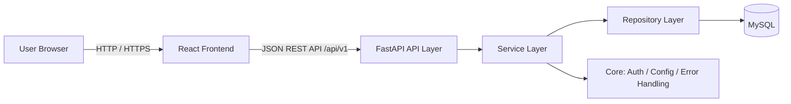
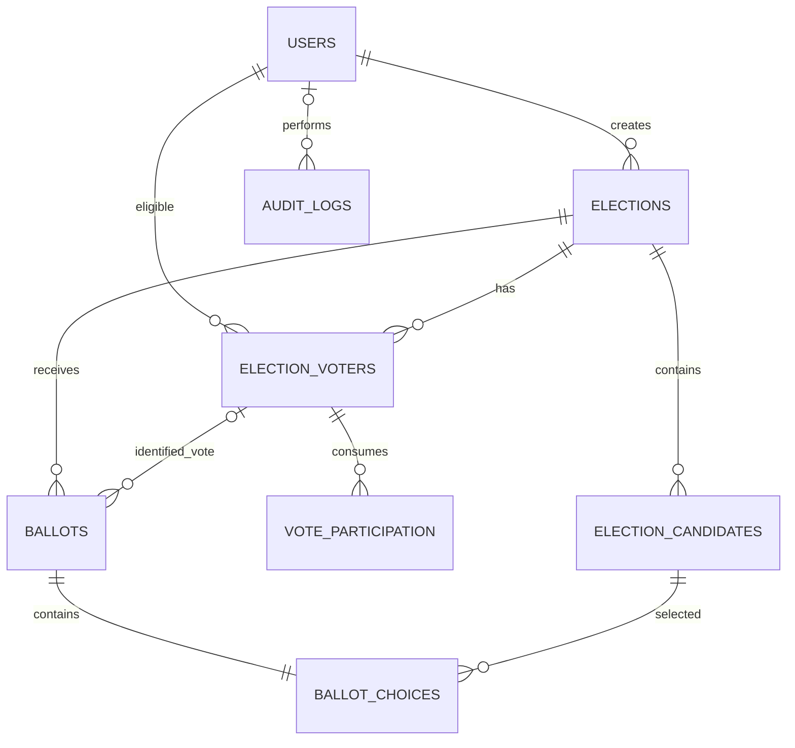
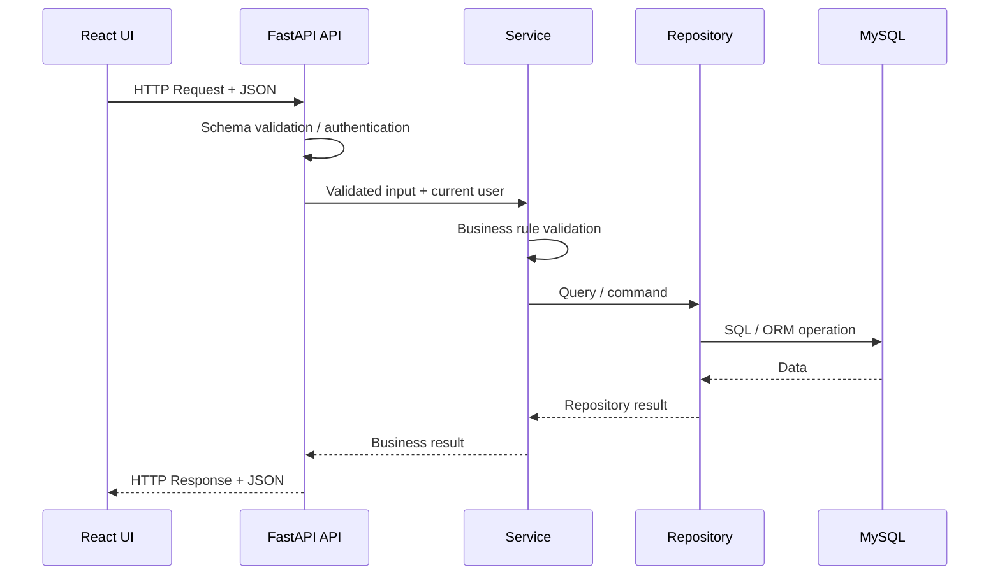
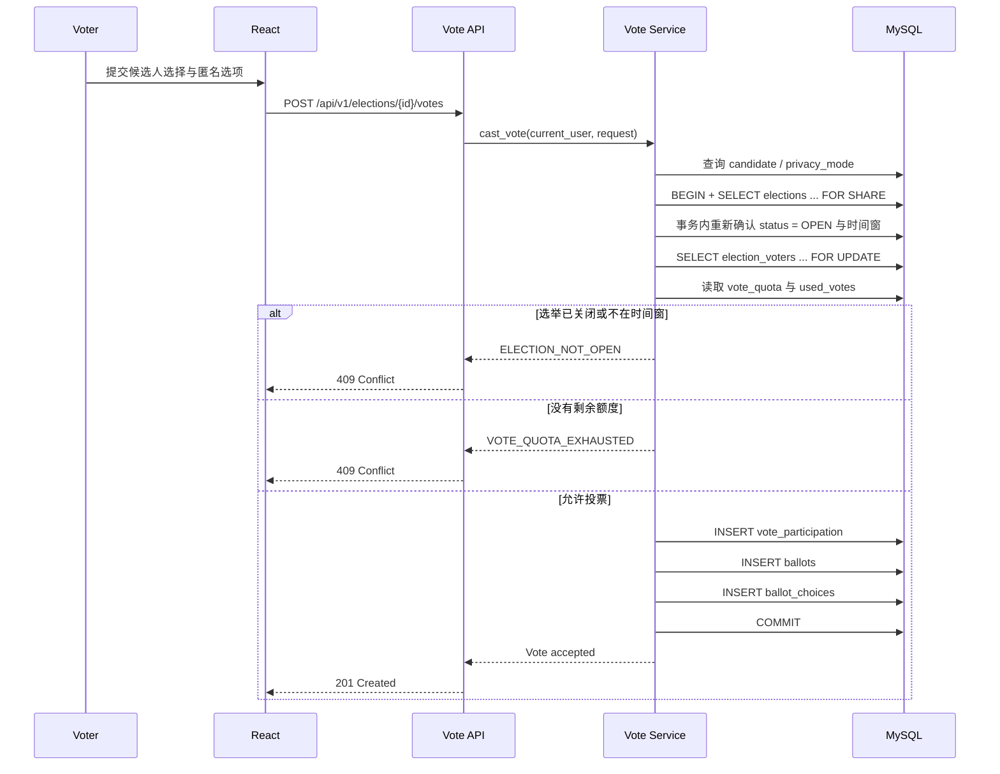

# 架构设计

[English](../../ARCHITECTURE.md) / 简体中文

---
> 架构版本：**v0.2**
> 需求基线：**SRS v0.1**
> 最后更新：2026-09-30
> 适用范围：COMP3500SEF 小组项目 · Election Management and Voting System · 首个 MVP
>
> 本文档描述项目的整体技术设计，包括**系统架构、技术栈、模块边界、前后端分层、数据库设计、关键流程、安全与隐私、测试与部署**。
>
> 本文档描述“系统为什么这样组织以及各部分如何协作”；具体 API 字段、完整建表实现与测试用例应由对应专项文档或代码维护，避免在多个位置重复定义同一事实。
>

---


## 1. 系统整体架构

整个系统采用 **React 前端 + Python / FastAPI 后端 + MySQL 数据库**的前后端分离架构。浏览器只与后端 REST API 通信，前端不得直接访问数据库。



系统当前按照**模块化单体（Modular Monolith）**组织：业务上划分身份、选举、候选人、选民、投票、结果等模块，但部署时仍作为一个 FastAPI 应用运行。当前规模没有必要引入微服务、消息队列或分布式数据库。

## 2. 分层

### 2.1 后端

后端采用三层架构，分别为：

- **接口层（API Layer）**：负责 HTTP API、Request / Response、输入参数解析与格式校验。
- **业务层（Service Layer）**：负责实现具体业务流程与业务规则。
- **数据交互层（Repository / DAO Layer）**：负责与数据库进行交互。

> [!ERROR] **注意**
>
> 严禁跨层访问。例如，接口层不得直接访问数据库；同时，也禁止在某一层中实现本应属于其他层的逻辑。

#### 2.1.1 后端各层的数据校验

数据校验按照职责分为以下三部分：

1. **接口层：格式校验**

   接口层负责检查外部输入在数据格式上是否合法，例如：

   - 必填字段是否缺失；
   - 数据类型是否正确；
   - 日期、时间等字段是否能够正常解析；
   - 数值是否超出允许范围；
   - 字符串长度、枚举值等是否满足接口约定。

   此类校验原则上由 FastAPI / Pydantic Schema 完成。

2. **业务层：业务规则校验**

   业务层负责检查数据及操作是否符合系统的业务规则，例如：

   - 当前时间是否仍处于投票时间范围内；
   - 用户是否具有该选举的投票资格；
   - 用户是否仍有剩余投票额度；
   - 候选人是否属于当前选举；
   - 当前选举状态是否允许执行该操作；
   - 提交的投票是否满足业务规则。

   如果业务层存在绕过 HTTP API 的调用方式，例如内部程序、后台任务或外部脚本直接调用 Service，则业务层必须保证其自身业务契约成立，并对必要的输入条件再次进行校验，不能依赖接口层作为唯一保护。

3. **数据交互层：数据完整性与安全**

   数据交互层不负责业务规则校验，只负责执行数据的查询、写入、修改和删除。

   数据库访问必须使用 ORM 或参数化查询，禁止通过字符串拼接构造 SQL，以避免 SQL Injection 等数据库攻击。

   同时，数据库应通过 `NOT NULL`、`UNIQUE`、`FOREIGN KEY`、`CHECK` 等约束保证最终数据的完整性。对于投票额度、外键关系、匿名字段一致性等关键规则，应尽可能同时使用数据库约束、事务与锁提供最后一道保护。

### 2.2 前端

前端采用五层架构，分别为：

- **路由层（Route Layer）**：负责 URL、页面之间的映射，以及页面导航与基础路由保护。
- **页面层（Page Layer）**：负责页面布局、组件组合以及页面级状态协调。
- **组件层（Component Layer）**：负责具体 UI 的展示与用户交互。
- **逻辑与状态层（Hook / Store Layer）**：负责前端业务流程、状态管理、共享状态以及数据处理。
- **数据访问层（API Layer）**：负责与后端 API 进行 HTTP 通信。

> [!ERROR] **注意**
>
> 原则上禁止跨层访问。例如，页面层和组件层不得直接发送 HTTP 请求，所有后端通信必须统一通过数据访问层完成。
>
> 同时，也禁止在某一层中实现本应属于其他层的逻辑。例如，组件层不得实现完整业务流程，数据访问层不得实现业务规则。

#### 2.2.1 前端各层职责

1. **路由层：页面导航**

   路由层负责：

   - URL 与页面之间的映射；
   - 页面跳转；
   - 登录状态等基础路由保护；
   - 无效路径处理。

   路由层仅负责前端导航控制，不作为系统权限控制的最终依据。

2. **页面层：页面组织**

   页面层负责：

   - 页面整体布局；
   - 页面组件的组合；
   - 页面级状态协调；
   - 调用逻辑与状态层提供的功能。

   页面层不得直接发送 HTTP 请求，也不应实现复杂业务逻辑。

3. **组件层：UI 与交互**

   组件层负责：

   - UI 展示；
   - 接收和显示数据；
   - 用户点击、输入等交互；
   - 组件自身的简单 UI 状态。

   组件层不得直接访问后端 API，也不应实现完整业务流程或关键业务规则。

4. **逻辑与状态层：业务流程与状态管理**

   逻辑与状态层负责：

   - 前端业务流程；
   - 页面或组件状态管理；
   - 跨页面共享状态；
   - 数据处理；
   - 调用数据访问层获取或修改数据。

   React 中主要通过 Custom Hook、Context、Store 等方式实现。

5. **数据访问层：后端通信**

   数据访问层负责：

   - HTTP 请求发送；
   - Request 参数构造；
   - Response 数据处理；
   - Token 注入；
   - HTTP 错误的统一处理。

   数据访问层只负责与后端通信，不负责业务规则或 UI 行为。

#### 2.2.2 前端数据校验

前端校验主要用于改善用户体验，例如：

- 检查必填字段；
- 检查输入格式；
- 判断按钮是否应被禁用；
- 根据当前状态控制页面或组件显示；
- 提前提示用户是否满足某些操作条件。

但是，前端中的权限判断、时间判断、投票资格判断、剩余投票额度判断等均**不能作为最终业务校验依据**。

所有关键业务规则必须由后端再次验证，前端校验仅作为用户体验层面的辅助机制。

## 3. 模块

### 3.1 后端

1. **身份 / 用户模块**
    - 职责：
        - 登录；
        - 身份认证；
        - 获取当前用户；
        - 角色与权限控制。

2. **选举模块**
    - 职责：
        - 创建选举；
        - 修改选举配置；
        - 开始 / 关闭选举；
        - 查询选举状态。

3. **候选人模块**
    - 职责：
        - 新增候选人；
        - 修改候选人；
        - 查询候选人；
        - 删除候选人。

4. **选民模块**
    - 职责：
        - 管理选民名册；
        - 判断用户是否具有投票资格。

5. **投票模块**
    - 职责：
        - 获取选票；
        - 提交选票；
        - 控制投票额度并防止超额投票；
        - 处理匿名 / 实名投票规则。

6. **结果模块**
    - 职责：
        - 计票；
        - 查看结果；
        - 发布结果。

7. **核心模块**
    - 职责：
        - 全局异常处理；
        - 统一响应格式；
        - 系统配置；
        - 公共基础功能。

### 3.2 前端

1. **身份 / 用户模块**
    - 职责：
        - 登录页面与登录操作；
        - 当前用户状态维护；
        - 登录状态判断；
        - 根据角色控制页面和功能显示。

2. **选举模块**
    - 职责：
        - 选举列表展示；
        - 选举详情展示；
        - 创建选举；
        - 修改选举配置；
        - 开始 / 关闭选举；
        - 展示选举状态。

3. **候选人模块**
    - 职责：
        - 候选人列表与详情展示；
        - 新增候选人；
        - 修改候选人；
        - 删除候选人。

4. **选民模块**
    - 职责：
        - 选民名册展示与管理；
        - 展示用户投票资格状态。

5. **投票模块**
    - 职责：
        - 展示选票；
        - 选择候选人；
        - 提交投票；
        - 展示投票成功或失败状态；
        - 根据当前状态控制投票界面。

6. **结果模块**
    - 职责：
        - 展示计票结果；
        - 展示已发布结果；
        - 管理员结果发布操作。

7. **公共模块**
    - 职责：
        - 公共 UI 组件；
        - 页面布局；
        - 导航；
        - Loading / Error / Modal 等通用组件；
        - 公共工具函数；
        - 前端全局配置。

## 4. 数据库

### 4.1 数据库总体设计

本项目在首个 MVP 阶段使用 **单 MySQL 数据库**，不进行物理分库，也不进行水平分表。

原因如下：

- 当前项目面向课程项目及班级规模选举，单个 MySQL 实例足以满足容量与性能需求；
- 投票提交涉及投票资格、投票额度消耗、选票与选票内容的原子写入，单库可以直接使用数据库事务保证一致性；
- 过早分库会额外引入跨库事务、数据同步、分布式 ID、跨库查询等复杂度；
- 当前阶段更重要的是通过合理的表结构、约束、索引与事务保证数据正确性。

数据库在逻辑上按照业务划分为以下数据域：

| 数据域 | 数据表 | 主要职责 |
|---|---|---|
| 身份与用户 | `users` | 登录账户、用户状态、系统角色 |
| 选举管理 | `elections` | 选举配置、状态、投票时间、匿名策略 |
| 候选人管理 | `election_candidates` | 维护某个选举下的候选人 |
| 选民管理 | `election_voters` | 维护选民名册以及每位选民的投票额度 |
| 投票额度消耗 | `vote_participation` | 每成功使用一次投票额度记录一条数据 |
| 选票 | `ballots` | 保存实际提交的选票 |
| 选票选择 | `ballot_choices` | 保存每张选票选择的候选人 |
| 审计 | `audit_logs` | 保存管理员及系统关键管理操作 |

数据库统一采用：

- Storage Engine：`InnoDB`；
- Character Set：`utf8mb4`；
- 时间统一以 UTC 写入数据库，由 API / 前端根据显示需要转换时区；
- 实体表主键使用自增 `BIGINT UNSIGNED`；
- 关联表根据业务情况使用复合主键或唯一约束；
- Schema 修改必须通过版本化 Migration 或版本化 Python 脚本管理，禁止仅在个人本地数据库手工修改。

> [!IMPORTANT]
>
> 当前 MVP 仍然可以配置为“一人一票”，只需要让所有 `election_voters.vote_quota = 1`。
>
> 数据库结构本身不把“一人一票”写死，因此后续允许某个用户拥有多张票时，不需要重新设计核心投票表。

---

### 4.2 数据库关系



> [!NOTE]
>
> `BALLOTS` 与 `ELECTION_VOTERS` 的关系是**可选的**：实名 ballot 关联一个 voter，匿名 ballot 不保存 voter 关联。

其中，`vote_participation` 与 `ballots` **故意分离**。

两者分别回答不同问题：

- `vote_participation`：某个用户在某场选举中已经使用了多少次投票额度；
- `ballots` / `ballot_choices`：某张实际选票选择了谁。

匿名投票时：

```text
vote_participation
知道：User 123 使用了第 1 次投票额度

ballots
知道：Ballot 5001 是一张匿名票

ballot_choices
知道：Ballot 5001 选择了 Candidate 8
```

但数据库中不存在：

```text
User 123 -> Ballot 5001
```

这样的直接映射。

因此系统可以同时做到：

1. 控制用户最多能够提交多少张票；
2. 对匿名选票不保存投票者身份；
3. 统计投票额度使用情况；
4. 保持真实选票与身份记录解耦。

> [!WARNING]
>
> 这里的“匿名”指**应用数据模型中不保存直接的 `user -> ballot -> candidate` 映射**，并不等同于密码学意义上的强匿名。
>
> 在低投票量场景下，具有数据库或完整日志访问权限的人仍可能通过 `voted_at`、`submitted_at`、写入顺序等元数据进行时间相关性分析。MVP 先实现直接身份解耦；如果课程要求更强的匿名威胁模型，需要进一步设计批量写入、匿名凭证或隔离存储等机制。

---

### 4.3 `users`：用户表

用于保存系统登录账户。

| 字段 | 类型 | 允许为空 | 约束 | 说明 |
|---|---|---:|---|---|
| `id` | `BIGINT UNSIGNED` | 否 | PK, AUTO_INCREMENT | 用户 ID |
| `username` | `VARCHAR(50)` | 否 | UNIQUE | 登录用户名 |
| `password_hash` | `VARCHAR(255)` | 否 |  | 密码 Hash，不保存明文密码 |
| `display_name` | `VARCHAR(100)` | 否 |  | 用户显示名称 |
| `role` | `VARCHAR(20)` | 否 | CHECK | `ADMIN` / `USER` |
| `status` | `VARCHAR(20)` | 否 | CHECK | `ACTIVE` / `DISABLED` |
| `created_at` | `DATETIME` | 否 |  | 创建时间 |
| `updated_at` | `DATETIME` | 否 |  | 最后更新时间 |

设计说明：

- 系统角色仅描述系统级权限；
- 用户是否能够参与某场选举，由 `election_voters` 决定；
- 候选人目前不要求拥有登录账户，因此候选人不直接存入 `users`；
- 密码只保存安全 Hash，禁止保存明文密码。

---

### 4.4 `elections`：选举表

保存每场选举的核心配置。

| 字段 | 类型 | 允许为空 | 约束 | 说明 |
|---|---|---:|---|---|
| `id` | `BIGINT UNSIGNED` | 否 | PK, AUTO_INCREMENT | 选举 ID |
| `title` | `VARCHAR(200)` | 否 |  | 选举名称 / 主题（如「2026 班长选举」） |
| `position_title` | `VARCHAR(100)` | 否 |  | 要选出的职位（如「班长」）；与选举名称 `title` 区分，对应 SRS FR-01 |
| `description` | `TEXT` | 是 |  | 选举说明 |
| `created_by` | `BIGINT UNSIGNED` | 否 | FK | 创建该选举的管理员 |
| `status` | `VARCHAR(20)` | 否 | CHECK | `DRAFT` / `OPEN` / `CLOSED` |
| `privacy_mode` | `VARCHAR(30)` | 否 | CHECK | 投票匿名策略 |
| `starts_at` | `DATETIME` | 否 |  | 投票开始时间 |
| `ends_at` | `DATETIME` | 否 | CHECK | 投票结束时间，必须晚于开始时间 |
| `results_published_at` | `DATETIME` | 是 |  | 结果发布时间；`NULL` 表示未发布 |
| `created_at` | `DATETIME` | 否 |  | 创建时间 |
| `updated_at` | `DATETIME` | 否 |  | 最后更新时间 |

#### 4.4.1 选举状态

首个 MVP 使用：

```text
DRAFT -> OPEN -> CLOSED
```

含义：

- `DRAFT`：仍处于配置阶段；
- `OPEN`：允许符合资格且仍有剩余投票额度的用户提交选票；
- `CLOSED`：停止接收新选票。

结果是否已经公开，不增加额外的 `PUBLISHED` 状态，而通过：

```text
results_published_at
```

判断。

这样避免把“投票生命周期”和“结果发布状态”混在同一个状态字段中。

#### 4.4.2 投票匿名模式

`privacy_mode` 支持：

| 值 | 含义 |
|---|---|
| `FORCED_ANONYMOUS` | 所有选票必须匿名 |
| `OPTIONAL_ANONYMOUS` | 用户提交每张选票时可以选择是否匿名 |
| `IDENTIFIED` | 所有选票必须实名 |

具体规则：

- `FORCED_ANONYMOUS`：`ballots.voter_id` 必须为 `NULL`；
- `OPTIONAL_ANONYMOUS`：每次提交时由用户决定是否保存 `voter_id`；
- `IDENTIFIED`：`ballots.voter_id` 必须保存当前用户 ID。

该规则需要同时读取 `elections.privacy_mode` 与提交内容，因此由 Service Layer 强制执行。

> [!IMPORTANT]
>
> **v1 仅启用 `FORCED_ANONYMOUS`。** `OPTIONAL_ANONYMOUS` 与 `IDENTIFIED` 是数据库已预留、但首版业务实现不开放的模式；其中 `IDENTIFIED` 会保存 `ballots.voter_id`，与 SRS FR-11 / NFR-2 的匿名存储要求冲突。若要开放，必须先更新 SRS 与对应验收标准。详见 4.21 与 ADR-008。

---

### 4.5 `election_candidates`：候选人表

用于保存某场选举中的候选人。

| 字段 | 类型 | 允许为空 | 约束 | 说明 |
|---|---|---:|---|---|
| `id` | `BIGINT UNSIGNED` | 否 | PK, AUTO_INCREMENT | 候选人 ID |
| `election_id` | `BIGINT UNSIGNED` | 否 | FK | 所属选举 |
| `name` | `VARCHAR(100)` | 否 |  | 候选人名称 |
| `description` | `TEXT` | 是 |  | 候选人简介 |
| `photo_url` | `VARCHAR(500)` | 是 |  | 候选人图片 URL |
| `display_order` | `INT` | 否 |  | 前端显示顺序 |
| `created_at` | `DATETIME` | 否 |  | 创建时间 |
| `updated_at` | `DATETIME` | 否 |  | 最后更新时间 |

设计说明：

- 候选人属于某一场具体选举；
- 候选人不一定是系统登录用户；
- 当前不对候选人姓名建立唯一约束，因为可能存在同名候选人；
- Service Layer 必须禁止在选举已经开始后随意改变候选人集合；
- 已经被选票引用的候选人不能直接删除；
- 为支持 `ballot_choices(election_id, candidate_id)` 的复合外键，Schema 应为 `(election_id, id)` 提供可引用的唯一键 / 索引。

---

### 4.6 `election_voters`：选民名册与投票额度表

该表不仅表示用户是否具有某场选举的投票资格，还保存该用户在该选举中一共拥有多少次投票额度。

| 字段 | 类型 | 允许为空 | 约束 | 说明 |
|---|---|---:|---|---|
| `election_id` | `BIGINT UNSIGNED` | 否 | PK, FK | 选举 ID |
| `user_id` | `BIGINT UNSIGNED` | 否 | PK, FK | 用户 ID |
| `vote_quota` | `INT UNSIGNED` | 否 | CHECK | 允许提交的选票数量，默认 `1` |
| `created_at` | `DATETIME` | 否 |  | 加入名册时间 |
| `updated_at` | `DATETIME` | 否 |  | 最后更新时间 |

复合主键：

```text
PRIMARY KEY (election_id, user_id)
```

该约束保证：

> 同一个用户在同一场选举中只有一条资格记录。

例如：

```text
election_id | user_id | vote_quota
1001        | 123     | 3
1001        | 456     | 1
```

表示：

```text
User 123 最多可以提交 3 张 ballot
User 456 最多可以提交 1 张 ballot
```

当前 MVP 的“一人一票”可以统一设置为：

```text
vote_quota = 1
```

`vote_quota` 必须大于 `0`。

> [!IMPORTANT]
>
> `vote_quota` 表示“一个用户可以提交多少张选票”，与“一张选票可以选择多少名候选人”是两个完全不同的概念。
>
> 当前 MVP：
>
> ```text
> 一个用户可提交多少张 ballot -> election_voters.vote_quota
> 一张 ballot 可选多少个 candidate -> 当前固定为 1
> ```

---

### 4.7 `vote_participation`：投票额度使用记录

每成功使用一次投票额度，就写入一条记录。

| 字段 | 类型 | 允许为空 | 约束 | 说明 |
|---|---|---:|---|---|
| `id` | `BIGINT UNSIGNED` | 否 | PK, AUTO_INCREMENT | 投票额度使用记录 ID |
| `election_id` | `BIGINT UNSIGNED` | 否 | FK | 选举 ID |
| `user_id` | `BIGINT UNSIGNED` | 否 | FK | 用户 ID |
| `vote_sequence` | `INT UNSIGNED` | 否 | CHECK；参与联合 UNIQUE(见下) | 该用户在该选举中第几次使用投票额度 |
| `voted_at` | `DATETIME` | 否 |  | 使用时间 |

联合唯一约束（由三个字段共同构成，`vote_sequence` 并不单独唯一）：

```text
UNIQUE (election_id, user_id, vote_sequence)
```

> [!NOTE]
>
> 该联合唯一约束只保证同一用户在同一选举中不会重复使用相同的额度序号，并不保证 `used_votes <= vote_quota`；后者是跨表数量约束，必须由 Service Layer 在事务与行锁下保证（见 4.12 与 4.18）。

例如一个用户拥有 3 张票，并全部使用：

```text
id | election_id | user_id | vote_sequence
1  | 1001        | 123     | 1
2  | 1001        | 123     | 2
3  | 1001        | 123     | 3
```

这意味着：

```text
User 123 已经使用了 3 次投票额度
```

但该表**不保存对应 ballot 的 ID，也不保存 candidate_id**。

这是为了避免匿名模式下重新建立：

```text
User -> vote_participation -> ballot -> candidate
```

的身份映射。

`vote_participation` 通过复合外键：

```text
(election_id, user_id)
```

引用：

```text
election_voters(election_id, user_id)
```

因此只有名册中的选民才能产生投票额度使用记录。

#### 4.7.1 剩余投票额度

已使用额度：

```sql
SELECT COUNT(*)
FROM vote_participation
WHERE election_id = ?
  AND user_id = ?;
```

剩余额度：

```text
remaining_votes = vote_quota - used_votes
```

只有：

```text
remaining_votes > 0
```

时才允许继续提交选票。

---

### 4.8 `ballots`：选票表

每成功提交一次投票，就生成一张不可修改的选票。

| 字段 | 类型 | 允许为空 | 约束 | 说明 |
|---|---|---:|---|---|
| `id` | `BIGINT UNSIGNED` | 否 | PK, AUTO_INCREMENT | 选票 ID |
| `election_id` | `BIGINT UNSIGNED` | 否 | FK | 所属选举 |
| `voter_id` | `BIGINT UNSIGNED` | 是 | FK | 实名投票者；匿名时为 `NULL` |
| `is_anonymous` | `BOOLEAN` | 否 | CHECK | 是否匿名 |
| `submitted_at` | `DATETIME` | 否 |  | 提交时间 |

数据库保证：

```text
is_anonymous = TRUE  -> voter_id IS NULL
is_anonymous = FALSE -> voter_id IS NOT NULL
```

对应约束：

```sql
CHECK (
    (is_anonymous = TRUE AND voter_id IS NULL)
    OR
    (is_anonymous = FALSE AND voter_id IS NOT NULL)
)
```

与旧的一人一票模型不同，**这里不能再建立：**

```text
UNIQUE (election_id, voter_id)
```

因为：

```text
vote_quota = 3
```

时，同一个用户在实名模式下需要能够合法产生：

```text
Ballot 1 -> voter_id = 123
Ballot 2 -> voter_id = 123
Ballot 3 -> voter_id = 123
```

因此“最多允许多少张 ballot”的规则不再通过 `ballots` 唯一约束实现，而由：

```text
election_voters.vote_quota
+
vote_participation
+
投票事务中的行锁
```

共同保证。

对于非匿名选票：

```text
(election_id, voter_id)
```

通过复合外键关联：

```text
election_voters(election_id, user_id)
```

从而保证实名选票中的用户属于当前选举名册。

同时，为支持 `ballot_choices(election_id, ballot_id)` 的复合外键，Schema 应为 `ballots(election_id, id)` 提供可引用的唯一键 / 索引。

> [!IMPORTANT]
>
> 匿名选票中不得保存能够直接恢复投票者身份的数据，例如 `voter_id`、用户名、学号或 participation ID。
>
> `ballots.id` 也不得通过审计日志、缓存或其他业务表重新与匿名投票者建立映射。

---

### 4.9 `ballot_choices`：选票选择表

用于保存每张选票最终选择的候选人。

| 字段 | 类型 | 允许为空 | 约束 | 说明 |
|---|---|---:|---|---|
| `id` | `BIGINT UNSIGNED` | 否 | PK, AUTO_INCREMENT | 记录 ID |
| `election_id` | `BIGINT UNSIGNED` | 否 | FK | 所属选举 |
| `ballot_id` | `BIGINT UNSIGNED` | 否 | FK, UNIQUE | 选票 ID |
| `candidate_id` | `BIGINT UNSIGNED` | 否 | FK | 候选人 ID |
| `created_at` | `DATETIME` | 否 |  | 创建时间 |

当前 MVP 为单选，因此建立：

```text
UNIQUE (ballot_id)
```

保证：

> 一张 ballot 最多只能选择一个 candidate。

同时通过复合外键保证：

- `ballot_id` 对应的选票属于 `election_id`；
- `candidate_id` 对应的候选人也属于同一个 `election_id`。

因此数据库本身可以阻止：

```text
Election A 的 ballot
投给 Election B 的 candidate
```

这种跨选举脏数据。

如果未来支持“每张选票可多选”，则修改的是 `ballot_choices` 的约束；这与 `vote_quota` 无关。

---

### 4.10 `audit_logs`：审计日志表

用于记录管理员及系统关键管理操作。

| 字段 | 类型 | 允许为空 | 约束 | 说明 |
|---|---|---:|---|---|
| `id` | `BIGINT UNSIGNED` | 否 | PK, AUTO_INCREMENT | 日志 ID |
| `actor_user_id` | `BIGINT UNSIGNED` | 是 | FK | 操作者；系统任务可为 `NULL` |
| `action` | `VARCHAR(100)` | 否 |  | 操作类型 |
| `resource_type` | `VARCHAR(50)` | 否 |  | 被操作资源类型 |
| `resource_id` | `BIGINT UNSIGNED` | 是 |  | 被操作资源 ID |
| `details` | `JSON` | 是 |  | 必要的附加信息 |
| `created_at` | `DATETIME` | 否 |  | 操作时间 |

典型日志：

```text
CREATE_ELECTION
UPDATE_ELECTION
OPEN_ELECTION
CLOSE_ELECTION
ADD_CANDIDATE
REMOVE_CANDIDATE
ADD_VOTER
UPDATE_VOTE_QUOTA
REMOVE_VOTER
PUBLISH_RESULT
```

> [!ERROR] **禁止记录匿名选票身份映射**
>
> 审计日志不得同时记录能够将用户和匿名选票内容重新关联的信息。
>
> 尤其禁止记录：
>
> ```text
> user_id
> +
> ballot_id
> ```
>
> 或：
>
> ```text
> user_id
> +
> candidate_id
> ```
>
> 否则 `ballots.voter_id = NULL` 将失去匿名意义。

---

### 4.11 数据库初始化、Migration 与配置

架构文档描述数据库结构和约束，不在正文中维护完整建库 / 建表代码。数据库初始化脚本独立放在仓库中，并进入版本控制。

当前项目统一使用 **Python 初始化脚本**，避免要求成员手工复制 SQL 或在不同终端中执行不同命令。建议结构：

```text
database/
    init/
        00_init_database.py
        01_init_schema.py
    migrations/
        02_xxx.py
        03_xxx.py
    seeds/
        seed_demo.py
```

职责：

- `00_init_database.py`
    - 读取环境变量；
    - 使用管理员 / Migration 账户连接 MySQL；
    - 创建项目数据库；
    - 创建 FastAPI 专用数据库用户；
    - 授予运行时最小权限。
- `01_init_schema.py`
    - 一次性创建当前基线版本的全部业务表；
    - 创建主键、外键、唯一约束、CHECK 与索引；
    - 不按“一个表一个脚本”拆散初始 Schema。
- `migrations/02_xxx.py`、`03_xxx.py` ...
    - 仅记录基线建立之后的结构变更；
    - 每次变更独立、可追踪、按顺序执行。

初始化顺序：

```text
.env / Environment Variables
    ↓
00_init_database.py
    ↓
创建 database + election_app
    ↓
01_init_schema.py
    ↓
FastAPI 使用 election_app 连接数据库
```

> [!IMPORTANT]
>
> FastAPI 运行时禁止直接使用 MySQL `root` 或其他管理员账户。应用专用用户 `election_app` 原则上仅授予业务运行所需的：
>
> ```text
> SELECT
> INSERT
> UPDATE
> DELETE
> ```
>
> `CREATE DATABASE`、`CREATE USER`、`GRANT`、DDL 与 Migration 由管理员账户或专用 Migration 账户执行。

初始化脚本与 FastAPI 均从环境变量读取连接信息：

```text
DB_HOST
DB_PORT
DB_NAME
DB_USER
DB_PASSWORD
```

管理员初始化所需的账号信息应使用单独的环境变量，不与运行时 `election_app` 凭据混用，例如：

```text
DB_ADMIN_USER
DB_ADMIN_PASSWORD
```

真实 `.env` 不提交到 Git；仓库只提交 `.env.example`。

开发 / Docker 环境可以临时使用：

```text
'election_app'@'%'
```

正式部署时应尽量限制数据库账户允许连接的来源。

当项目进入稳定阶段，可以将已经确认的 Migration 合并回新的基线 Schema；但已经在共享环境执行过的 Migration 不应直接修改历史内容。
---

### 4.12 投票提交事务

允许多票以后，不能再用简单的：

```text
SELECT 是否投过票
```

来判断。

正确逻辑是：

```text
这个用户一共有多少票？
已经用了多少票？
是否还有剩余额度？
```

一次投票的事务流程：

```text
检查用户身份
    ↓
检查选举存在
    ↓
检查候选人属于当前 election
    ↓
检查 privacy_mode 与本次匿名选择是否合法
    ↓
BEGIN TRANSACTION
    ↓
SELECT elections ... FOR SHARE   （锁住选举行，与“关闭选举”互斥）
    ↓
事务内重新确认 status = OPEN
    ↓
事务内重新确认当前时间处于 starts_at ~ ends_at
    ↓
SELECT election_voters ... FOR UPDATE
    ↓
读取 vote_quota
    ↓
统计当前已使用额度
    ↓
如果 used_votes >= vote_quota -> ROLLBACK / 拒绝
    ↓
计算下一 vote_sequence
    ↓
INSERT vote_participation
    ↓
INSERT ballots
    ↓
INSERT ballot_choices
    ↓
COMMIT
```

> [!IMPORTANT]
>
> 选举 `status` 与投票时间窗是会被并发修改的**动态状态**，必须在事务内、持有 `elections` 行共享锁时重新确认。事务开始前的检查只能用于快速失败，不具权威性；否则会与并发的“关闭选举”产生竞态（见 4.12.3）。

事务内第一步先对选举行加共享锁，并在锁保护下重新确认状态与时间窗：

```sql
SELECT status, starts_at, ends_at
FROM elections
WHERE id = ?
FOR SHARE;
```

`FOR SHARE` 与“关闭选举”使用的 `FOR UPDATE` 互斥：多个投票事务可同时持有同一选举行的共享锁而互不阻塞；“关闭选举”必须等待所有在途投票事务释放共享锁后，才能取得排他锁并把状态改为 `CLOSED`；关闭提交后，新的投票事务读取到 `CLOSED` 即被拒绝。

随后锁住当前用户在当前选举中的资格记录：

```sql
SELECT vote_quota
FROM election_voters
WHERE election_id = ?
  AND user_id = ?
FOR UPDATE;
```

`FOR UPDATE` 用于锁住当前用户在当前选举中的资格记录。统一加锁顺序为 `elections` → `election_voters`，以避免与并发事务发生死锁。

随后统计：

```sql
SELECT
    COUNT(*) AS used_votes,
    COALESCE(MAX(vote_sequence), 0) AS last_sequence
FROM vote_participation
WHERE election_id = ?
  AND user_id = ?;
```

如果：

```text
used_votes >= vote_quota
```

则拒绝本次投票。

否则：

```text
next_vote_sequence = last_sequence + 1
```

并继续写入。

#### 4.12.1 为什么必须加行锁

假设：

```text
vote_quota = 3
used_votes = 2
```

用户同时发送两个请求：

```text
Request A
Request B
```

如果没有锁：

```text
A 读取 used = 2
B 读取 used = 2

A 判断还有票
B 判断还有票
```

最终可能提交第 3、4 张票。

使用：

```sql
SELECT ... FOR UPDATE
```

后：

```text
A
锁住 election_voters
2 < 3
提交第 3 张票
COMMIT

B
等待 A 释放锁
重新读取
3 == 3
拒绝
```

因此不会超额。

#### 4.12.2 事务原子性

以下三条数据必须始终同时成功或同时失败：

1. `vote_participation`：消耗一次投票额度；
2. `ballots`：创建实际选票；
3. `ballot_choices`：写入选票选择。

如果其中任意一步失败：

```text
ROLLBACK
```

不允许出现：

```text
投票额度已经消耗
但 ballot 没有写入
```

也不允许：

```text
ballot 已经写入
但 vote_participation 没有写入
```

#### 4.12.3 投票与关闭选举的并发协调

“提交投票”与“关闭选举”可能并发发生。若选举状态只在事务开始前检查一次，会出现如下竞态：

```text
1. 投票请求在事务外检查 status = OPEN，通过
2. 管理员并发关闭选举，CLOSED 提交成功
3. 投票请求 BEGIN，仅锁定 election_voters
4. 投票写入并 COMMIT
```

结果：选举已经 `CLOSED`，但仍有一张选票被成功写入。

仅在事务内“重新读取一次状态”并不能消除该竞态：

- 在 `REPEATABLE READ` 下，事务读取的是快照，可能根本看不到并发已提交的 `CLOSED`；
- 即使在 `READ COMMITTED` 下，“重新检查”与 `COMMIT` 之间仍存在时间窗，关闭可能恰好落入其中。

因此必须让投票与关闭在**同一把 `elections` 行锁**上协调：

```text
投票事务： SELECT elections ... FOR SHARE   （共享锁）
关闭选举： SELECT elections ... FOR UPDATE  （排他锁）
```

- 共享锁之间兼容，多个投票可并发进行；
- 排他锁与共享锁互斥，关闭必须等待在途投票事务全部提交 / 回滚并释放共享锁；
- 关闭取得排他锁并改为 `CLOSED` 后，后续投票的 `FOR SHARE` 读取到 `CLOSED`，直接拒绝。

**投票截止时点 = 关闭事务提交的瞬间。** 在该瞬间之前已经提交的投票全部计入；之后到达的投票一律拒绝。到达 `ends_at` 的时间窗关闭同理，由投票事务内以服务器时钟重新确认。

> [!WARNING]
>
> 必须统一加锁顺序为 `elections` → `election_voters`。若不同代码路径以相反顺序加锁，并发时可能互相等待对方持有的行锁而死锁。

---

### 4.13 匿名投票数据流

假设：

```text
user_id = 123
election_id = 1001
vote_quota = 3
```

#### 4.13.1 第一次强制匿名投票

```text
vote_participation
------------------------------------------------
id | election_id | user_id | vote_sequence
1  | 1001        | 123     | 1
```

```text
ballots
---------------------------------------------
id   | election_id | voter_id | is_anonymous
5001 | 1001        | NULL     | TRUE
```

```text
ballot_choices
--------------------------------------------
ballot_id | election_id | candidate_id
5001      | 1001        | 8
```

数据库能够知道：

```text
User 123 已经使用 1 / 3 次投票额度
```

也能够知道：

```text
Ballot 5001 选择 Candidate 8
```

但不能直接证明：

```text
User 123 -> Ballot 5001
```

#### 4.13.2 第二次匿名投票

用户再次投票：

```text
vote_participation
------------------------------------------------
id | election_id | user_id | vote_sequence
2  | 1001        | 123     | 2
```

新的匿名 ballot：

```text
5002 | 1001 | NULL | TRUE
```

仍然不存在 participation 与具体 ballot 的直接外键关系。

#### 4.13.3 可选匿名

用户每提交一张 ballot 都可以独立选择：

```text
匿名：
voter_id = NULL
is_anonymous = TRUE
```

或者：

```text
实名：
voter_id = 当前用户 ID
is_anonymous = FALSE
```

因此同一个用户在 `OPTIONAL_ANONYMOUS` 模式下，理论上可以：

```text
第 1 张匿名
第 2 张实名
第 3 张匿名
```

#### 4.13.4 强制实名

`IDENTIFIED` 模式下，每张 ballot 都必须：

```text
voter_id = 当前用户 ID
is_anonymous = FALSE
```

同一个用户存在多张实名 ballot 是合法的，只要总数量不超过 `vote_quota`。

---

### 4.14 计票与结果发布

当前 MVP 不单独建立 `results` 表。

结果从 `ballot_choices` 实时计算：

```sql
SELECT
    c.id AS candidate_id,
    c.name,
    COUNT(bc.id) AS vote_count
FROM election_candidates c
LEFT JOIN ballot_choices bc
    ON bc.election_id = c.election_id
   AND bc.candidate_id = c.id
WHERE c.election_id = ?
GROUP BY c.id, c.name
ORDER BY
    vote_count DESC,
    c.display_order ASC,
    c.id ASC;
```

这样：

- 每张 ballot 计为一票；
- 某个用户拥有多张 ballot 时，每张合法 ballot 都独立计票；
- 0 票候选人仍会出现在结果中。

结果是否允许普通用户查看，由：

```text
elections.results_published_at
```

控制。

---

### 4.15 参与率与投票额度使用率

允许一人多票后，需要区分两个统计指标。

#### 4.15.1 选民参与率

含义：

> 有多少合资格选民至少投过一次。

总选民人数：

```sql
SELECT COUNT(*)
FROM election_voters
WHERE election_id = ?;
```

至少投过一次的人数：

```sql
SELECT COUNT(DISTINCT user_id)
FROM vote_participation
WHERE election_id = ?;
```

计算：

```text
voter_participation_rate
=
voters_who_voted / eligible_voters
```

#### 4.15.2 投票额度使用率

含义：

> 系统一共发出了多少投票额度，其中实际用了多少。

总投票额度：

```sql
SELECT COALESCE(SUM(vote_quota), 0)
FROM election_voters
WHERE election_id = ?;
```

已使用额度：

```sql
SELECT COUNT(*)
FROM vote_participation
WHERE election_id = ?;
```

计算：

```text
vote_quota_usage_rate
=
used_vote_quota / total_vote_quota
```

例如：

```text
10 个选民
每人 3 张票
总额度 = 30

其中 8 个人至少投过一次
一共实际提交 20 张票
```

则：

```text
选民参与率 = 8 / 10 = 80%
票额使用率 = 20 / 30 ≈ 66.7%
```

这两个指标不能混为一谈。

---

### 4.16 数据修改与删除规则

数据库外键负责阻止明显破坏完整性的操作；Service Layer 根据选举状态进一步限制业务行为。

| 数据 | `DRAFT` | `OPEN` | `CLOSED` |
|---|---|---|---|
| 修改选举基本信息 | 允许 | 原则上禁止关键规则修改 | 原则上禁止 |
| 新增 / 删除候选人 | 允许 | 禁止 | 禁止 |
| 修改选民名册 | 允许 | 原则上禁止 | 禁止 |
| 修改 `vote_quota` | 允许 | 原则上禁止 | 禁止 |
| 修改已提交选票 | 不适用 | 禁止 | 禁止 |
| 删除已提交选票 | 不适用 | 禁止 | 禁止 |
| 修改 / 删除 participation | 不适用 | 禁止 | 禁止 |
| 发布结果 | 禁止 | 禁止 | 允许 |

> [!IMPORTANT]
>
> 一旦选举进入 `OPEN`，原则上不允许调整 `vote_quota`。
>
> 否则可能出现：
>
> ```text
> 用户已经使用 3 张票
> 管理员把 vote_quota 从 3 改成 1
> ```
>
> 从而产生历史数据与当前规则冲突。

对于已提交投票：

```text
vote_participation
ballots
ballot_choices
```

在正常业务流程中均视为不可变数据。

---

### 4.17 索引策略

| 表 | 索引 | 用途 |
|---|---|---|
| `users` | `UNIQUE(username)` | 登录时按用户名查询 |
| `elections` | `(status, starts_at, ends_at)` | 查询当前选举 |
| `election_candidates` | `(election_id, display_order, id)` | 查询某选举候选人 |
| `election_candidates` | `UNIQUE(election_id, id)` | 支持跨表复合外键，保证 choice 的 candidate 属于同一 election |
| `election_voters` | PK `(election_id, user_id)` | 查询资格并锁定投票额度 |
| `election_voters` | `(user_id, election_id)` | 查询用户可参与的选举 |
| `vote_participation` | `UNIQUE(election_id, user_id, vote_sequence)` | 保证同一次额度序号不会重复 |
| `vote_participation` | `(election_id, user_id)` | 统计已使用额度 |
| `ballots` | `(election_id, submitted_at)` | 按选举查询 / 统计选票 |
| `ballots` | `UNIQUE(election_id, id)` | 支持 `ballot_choices` 的同选举复合外键 |
| `ballots` | `(election_id, voter_id)` | 实名模式下按用户查询选票 |
| `ballot_choices` | `UNIQUE(ballot_id)` | 保证 MVP 单选 |
| `ballot_choices` | `(election_id, candidate_id)` | 计票 |
| `audit_logs` | `(actor_user_id, created_at)` | 查询用户操作日志 |
| `audit_logs` | `(resource_type, resource_id, created_at)` | 查询资源审计记录 |

禁止无目的地大量添加索引，因为索引会增加写入与维护成本。

---

### 4.18 数据完整性分工

#### 数据库直接保证

- 主键唯一；
- 用户名唯一；
- 外键引用存在；
- 同一用户在同一选举中只有一条名册记录；
- `vote_quota > 0`；
- `vote_sequence > 0`；
- 同一用户同一选举中相同 `vote_sequence` 不会重复；
- participation 对应的用户必须属于该选举名册；
- 匿名 ballot 不保存 `voter_id`；
- 非匿名 ballot 必须保存 `voter_id`；
- 实名 ballot 的用户必须属于当前选举名册；
- 当前 MVP 一张 ballot 只能选择一个 candidate；
- ballot 与 candidate 必须属于同一个 election；
- 复合外键所需的 `(election_id, id)` 引用键存在；
- 结束时间晚于开始时间。

#### Service Layer 必须保证

- 只有管理员可以创建或修改选举；
- 只有 `OPEN` 状态允许投票；
- 当前时间在投票时间范围内；
- 用户处于启用状态；
- 用户存在于当前选举名册；
- `used_votes < vote_quota`；
- 投票额度检查必须在锁定 `election_voters` 行后执行；
- `vote_sequence` 按顺序生成；
- candidate 属于当前 election；
- `privacy_mode` 与本次匿名选择一致；
- `OPEN` 后禁止任意修改 `vote_quota`；
- 三张投票相关表必须位于同一个事务中写入；
- 结果满足发布条件后才能公开；
- 审计日志不得泄露匿名 ballot 的身份映射。

> [!NOTE]
>
> `used_votes <= vote_quota` 是跨表数量约束，普通 MySQL `CHECK` 无法直接通过另一个表的 `COUNT(*)` 保证。
>
> 因此该规则由 Service Layer 在事务和行锁下保证，数据库唯一约束负责辅助防止重复序号等结构性错误。

---

### 4.19 数据库命名规范

统一采用：

```text
表名：
snake_case + 复数

users
elections
election_candidates
vote_participation
```

字段：

```text
snake_case

created_at
election_id
vote_quota
vote_sequence
```

实体主键：

```text
id
```

外键：

```text
<resource>_id
```

布尔值：

```text
is_<state>
```

ORM Model、Repository 与数据库字段名应尽量保持一致。

---

### 4.20 Migration 与初始化数据

所有数据库结构修改必须进入版本控制。

当前阶段使用版本化 Python 初始化 / Migration 脚本；如果后续 ORM 与团队工作流需要，也可以迁移到 Alembic 等正式 Migration 工具。

```text
database/
    init/
        00_init_database.py
        01_init_schema.py
    migrations/
        02_xxx.py
        03_xxx.py
    seeds/
        seed_demo.py
```

禁止出现：

```text
成员 A 本地 ALTER TABLE
成员 B 没有对应修改
CI / Demo 环境无法复现
```

测试数据使用独立 Seed 脚本生成，不得把测试数据混入正式 Schema Migration。

---

### 4.21 当前数据库设计边界

> [!IMPORTANT]
>
> **数据库结构 ≠ v1 启用范围。** 下面列出的是数据库*预留*的能力；首版（MVP）业务实现只启用其中一部分，其余为“设计预留但 v1 不开放”，开发人员不得仅依据本架构就实现全部模式。
>
> v1 实际启用：
>
> - 单选 ballot（一张选票对应一个 `ballot_choice`）；
> - 一人一票（所有 `election_voters.vote_quota = 1`）；
> - 强制匿名（`privacy_mode` 固定为 `FORCED_ANONYMOUS`）；
> - 得票最高者当选。
>
> v1 设计预留但不开放：`vote_quota > 1`（一人多票）、`OPTIONAL_ANONYMOUS`、`IDENTIFIED`。开放前必须先更新 SRS 与对应验收标准。依据见 SRS FR-02 / FR-10 / FR-11 / NFR-2 与 BR 说明「其余保持可配置空间但不实现」；决策记录见 ADR-008。

当前结构支持：

- 单选 ballot；
- 每位用户默认一票；
- 可按选民配置 `vote_quota > 1`，允许一人多票；
- 管理员 / 普通用户；
- 候选人不要求拥有登录账户；
- 强制匿名；
- 可选匿名；
- 强制实名；
- 结果在选举关闭后发布；
- 不允许撤回、修改或删除已经提交的 ballot。

当前尚未实现：

- 一张 ballot 多选多个候选人；
- 排序投票；
- 加权候选人得分；
- 多轮选举工作流；
- 投票撤回；
- 已提交 ballot 修改；
- 复杂 RBAC；
- 结果快照；
- 分库分表；
- 独立分析数据库。

需要特别区分：

```text
vote_quota > 1
```

表示：

> 一个用户可以提交多张 ballot。

而未来的：

```text
一张 ballot 允许多个 ballot_choices
```

表示：

> 一张选票可以同时选择多个候选人。

这是两套不同的扩展能力，不应混在同一个字段中。

---

## 5. 技术栈与技术边界

### 5.1 前端

| 项目 | 选择 | 作用 |
|---|---|---|
| UI Framework | React | 构建浏览器端页面与组件 |
| Communication | HTTP / HTTPS + JSON | 调用 FastAPI REST API |
| Routing | React 路由方案 | URL 与页面映射、基础路由保护 |
| State / Logic | Hook / Context / Store | 页面流程与共享状态 |

前端只负责展示、交互与客户端状态。权限、投票资格、剩余投票额度、时间窗等关键规则必须由后端再次验证。

### 5.2 后端

| 项目 | 选择 | 作用 |
|---|---|---|
| Language | Python | 后端实现语言 |
| Web Framework | FastAPI | REST API、依赖注入与 HTTP 层 |
| Schema Validation | Pydantic | Request / Response Schema 与格式校验 |
| Authentication | JWT | API 身份认证 |
| Persistence | Repository / DAO + 参数化查询或 ORM | 数据库访问 |

数据库访问实现可以使用 ORM 或参数化 SQL，但**无论采用哪一种方式，都不得绕过 Repository Layer，也不得通过字符串拼接 SQL**。具体 ORM / Driver 如果尚未确定，不在架构文档中强行绑定。

### 5.3 数据库

| 项目 | 选择 |
|---|---|
| Database | MySQL |
| Storage Engine | InnoDB |
| Character Set | utf8mb4 |
| Time Storage | UTC |

选择 MySQL / InnoDB 的核心原因是当前系统依赖事务、行锁、外键与一致性约束完成投票额度控制。

### 5.4 当前明确不引入的技术

首个 MVP 不引入：

- 微服务；
- 消息队列；
- Redis 作为业务正确性的必要依赖；
- 分布式事务；
- 分库分表；
- 区块链；
- 独立数据仓库 / 分析数据库。

这些能力只有在出现明确需求后才重新评估，不为了“架构看起来复杂”而提前加入。

---

## 6. 项目结构

下面是**目标目录结构**，用于落实第 2 章的分层和第 3 章的业务模块。实际文件名可以调整，但依赖方向不能被破坏。

```text
project-root/
├── backend/
│   ├── app/
│   │   ├── api/              # Route / HTTP Layer
│   │   ├── services/         # Business Logic
│   │   ├── repositories/     # Database Access
│   │   ├── schemas/          # Pydantic Request / Response
│   │   ├── models/           # Persistence / Domain Models
│   │   ├── core/             # Config, auth, errors, shared infrastructure
│   │   └── db/               # Connection / session / transaction helpers
│   └── tests/
│       ├── unit/
│       ├── integration/
│       └── api/
│
├── frontend/
│   └── src/
│       ├── routes/
│       ├── pages/
│       ├── components/
│       ├── hooks/
│       ├── store/
│       ├── api/              # HTTP client / endpoint wrappers
│       └── shared/
│
├── database/
│   ├── init/
│   │   ├── 00_init_database.py
│   │   └── 01_init_schema.py
│   ├── migrations/
│   └── seeds/
│
├── docs/
│   ├── api/                  # Detailed API specification
│   └── adr/                  # Architecture Decision Records
│
├── .env.example
└── README.md
```

### 6.1 后端文件职责

典型调用关系：

```text
api/votes.py
    ↓
services/vote_service.py
    ↓
repositories/vote_repository.py
    ↓
MySQL
```

`schemas/` 负责 HTTP 数据契约，`models/` 负责持久化 / 领域数据结构。两者不能因为字段相似就直接混为一层。

### 6.2 按业务模块组织

如果后续文件数量增加，可以在各层内部再按业务模块划分：

```text
api/
    auth.py
    elections.py
    candidates.py
    voters.py
    votes.py
    results.py
```

Service 与 Repository 使用相同的业务边界，避免出现一个巨大 `service.py` 或 `repository.py` 承担所有功能。

### 6.3 配置与 Secret

所有环境相关配置由环境变量注入。仓库中只提供 `.env.example`，不得提交真实 `.env`。

开发人员本地、CI、测试和 Demo 环境可以使用不同 `.env` / Secret 配置，但代码读取方式保持一致。

---

## 7. 组件依赖与通信规则

### 7.1 后端依赖方向

后端只允许：

```text
API Layer
    ↓
Service Layer
    ↓
Repository Layer
    ↓
Database
```

允许 Service 同时协调多个 Repository，例如投票事务可以同时调用 voter、participation、ballot 与 choice 相关的数据访问逻辑。

禁止：

```text
API -> Repository
Repository -> Service
Repository -> API
Database-specific logic -> API
```

`core/` 提供认证、配置、异常、日志等基础能力，但不应反向依赖具体业务模块。

### 7.2 前端依赖方向

前端主要依赖关系为：

```text
Route
  ↓
Page
  ↓
Hook / Store
  ↓
API Client
  ↓
FastAPI
```

`Component` 由 Page / Hook 提供数据和回调，原则上不直接发送 HTTP 请求。

### 7.3 跨模块调用

跨业务模块的业务流程应由 Service Layer 协调，而不是让 Repository 之间互相调用。

例如“提交投票”同时涉及：

```text
Election
Voter Eligibility
Vote Participation
Ballot
Ballot Choice
```

这些规则统一由 `Vote Service` 组织事务边界，Repository 只提供数据操作能力。

### 7.4 一次请求的数据流



### 7.5 事务归属

事务边界由 **Service Layer** 决定，因为只有 Service 知道“一次业务操作”需要同时修改哪些表。Repository 不应擅自把一个完整业务流程拆成互不相关的独立提交。

对于投票提交，`vote_participation + ballots + ballot_choices` 必须处于同一个事务中。

---

## 8. API 设计

前端统一通过 **HTTP REST API** 与 FastAPI 后端通信。

基础路径统一为：

```text
/api/v1
```

其中 `v1` 表示当前 API 的主版本。未来如果出现无法保持向后兼容的接口变更，可以新增 `/api/v2`，而不是直接破坏现有前端调用。

客户端与后端之间默认使用 JSON 交换数据；正式部署环境应通过 HTTPS 传输。

### 8.1 API Layer 职责

API Layer 负责：

- 接收 HTTP Request；
- 通过 Pydantic Schema 完成请求格式校验；
- 获取当前登录用户；
- 调用对应的 Service；
- 将 Service 返回结果转换为 HTTP Response；
- 将业务异常转换为统一的 HTTP 状态码与错误结构。

API Layer **不得直接访问数据库，也不得实现核心业务规则**。

例如：

```text
当前用户是否还有剩余投票额度
```

属于 Service Layer 的业务规则，而不是 API Layer 的职责。

### 8.2 主要资源

当前 MVP 主要 API 资源如下：

```text
/api/v1/auth
/api/v1/users
/api/v1/elections
/api/v1/elections/{election_id}/candidates
/api/v1/elections/{election_id}/voters
/api/v1/elections/{election_id}/ballot
/api/v1/elections/{election_id}/participation
/api/v1/elections/{election_id}/votes
/api/v1/elections/{election_id}/results
```

资源含义：

| 路径 | 主要用途 |
|---|---|
| `/auth` | 登录、获取当前身份等认证功能 |
| `/users` | 用户管理 |
| `/elections` | 选举创建、查询、配置与状态管理 |
| `/candidates` | 某场选举的候选人管理 |
| `/voters` | 某场选举的选民名册与投票额度管理 |
| `/ballot` | 获取当前选举的可投票内容 |
| `/participation` | 获取当前用户的资格、已使用额度和剩余额度，不返回具体 ballot 映射 |
| `/votes` | 提交实际选票 |
| `/results` | 查询与发布结果 |

典型接口示例：

```text
POST   /api/v1/auth/login
GET    /api/v1/auth/me

GET    /api/v1/elections
POST   /api/v1/elections
GET    /api/v1/elections/{election_id}
PATCH  /api/v1/elections/{election_id}

POST   /api/v1/elections/{election_id}/open
POST   /api/v1/elections/{election_id}/close

GET    /api/v1/elections/{election_id}/candidates
POST   /api/v1/elections/{election_id}/candidates

GET    /api/v1/elections/{election_id}/voters
POST   /api/v1/elections/{election_id}/voters

GET    /api/v1/elections/{election_id}/ballot
GET    /api/v1/elections/{election_id}/participation
POST   /api/v1/elections/{election_id}/votes

GET    /api/v1/elections/{election_id}/results
POST   /api/v1/elections/{election_id}/results/publish
```

> [!NOTE]
>
> 本架构文档只规定资源边界和主要调用方式。
>
> 完整的 Request Schema、Response Schema、字段说明、状态码和示例应放在独立 API Specification 中维护，避免架构文档变成接口字典。

### 8.3 Authentication

受保护接口必须携带 JWT Access Token：

```http
Authorization: Bearer <token>
```

后端从经过验证的 Token 中取得当前用户身份，**不得相信前端自行提交的 `user_id` 来判断当前操作者**。

认证失败时，请求不进入需要身份的业务流程。

### 8.4 Response Format

成功响应使用 HTTP `2xx` 状态码。

一般数据响应：

```json
{
    "data": {
        "...": "..."
    }
}
```

如果存在分页或其他附加信息，可以增加 `meta`：

```json
{
    "data": [],
    "meta": {
        "page": 1,
        "page_size": 20,
        "total": 100
    }
}
```

错误响应统一为：

```json
{
    "error": {
        "code": "VOTE_QUOTA_EXHAUSTED",
        "message": "No remaining vote quota."
    }
}
```

API 不应将数据库异常、SQL、Stack Trace 或其他内部实现细节直接返回给客户端。

### 8.5 HTTP 状态码约定

常用状态码：

| 状态码 | 用途 |
|---|---|
| `200 OK` | 查询或普通操作成功 |
| `201 Created` | 创建资源或成功提交选票 |
| `204 No Content` | 成功且无需返回正文 |
| `400 Bad Request` | 请求语义不合法 |
| `401 Unauthorized` | 未登录或 Token 无效 |
| `403 Forbidden` | 已认证但无权限 |
| `404 Not Found` | 资源不存在 |
| `409 Conflict` | 当前资源状态与操作冲突，例如额度耗尽、状态冲突 |
| `422 Unprocessable Entity` | Request Schema / 字段校验失败 |
| `500 Internal Server Error` | 未预期的服务端错误 |

具体错误码以 API Specification 为准。

---

## 9. 关键流程

本节描述跨前端、API、Service 与数据库的核心业务流程，不重复数据库章节中的全部 SQL 细节。

### 9.1 用户登录

```text
User
  ↓
React Frontend
  ↓
POST /api/v1/auth/login
  ↓
Auth API
  ↓
Auth Service
  ↓
User Repository
  ↓
MySQL
```

流程：

1. 用户提交用户名与密码；
2. API Layer 完成 Request 格式校验；
3. Auth Service 查询用户并验证密码 Hash；
4. 检查用户状态是否允许登录；
5. 验证成功后生成 JWT Access Token；
6. Token 返回前端；
7. 后续受保护请求通过 `Authorization: Bearer <token>` 携带 Token。

### 9.2 创建选举

```text
Administrator
    ↓
Election API
    ↓
Election Service
    ↓
Election Repository
    ↓
MySQL
```

Election Service 至少检查：

- 当前用户是否具有管理员权限；
- 标题等必需配置是否存在；
- `starts_at < ends_at`；
- `privacy_mode` 是否为合法值；
- 初始状态是否符合选举生命周期规则。

创建成功后，选举进入 `DRAFT` 状态。

候选人、选民名册以及 `vote_quota` 原则上应在 `DRAFT` 阶段完成配置。

### 9.3 开始选举

管理员请求开启选举时：

```text
Administrator
    ↓
POST /api/v1/elections/{id}/open
    ↓
Election Service
    ↓
检查 DRAFT 状态与必要配置
    ↓
更新为 OPEN
```

Service Layer 应确认选举满足开始条件，例如：

- 当前状态为 `DRAFT`；
- 至少存在合法候选人；
- 时间配置有效；
- 隐私模式已经确定；
- 选民名册符合当前业务要求。

进入 `OPEN` 后，候选人集合、选民名册、`vote_quota`、隐私模式等会影响投票语义的关键配置原则上不得再修改。

### 9.4 获取选票

用户进入投票页面时：

```text
Voter
  ↓
GET /api/v1/elections/{id}/ballot
  ↓
Ballot API
  ↓
Vote Service
  ↓
读取选举与候选人信息
```

返回内容可以包括：

- 选举标题与说明；
- 当前状态与投票时间；
- 候选人列表；
- 当前 `privacy_mode`；
- 是否允许用户自行选择匿名；
- 当前用户是否具有投票资格；
- 当前用户剩余投票额度。

其中资格和剩余额度只用于告诉用户“还能不能投”，**不得返回任何能够把匿名 ballot 与当前用户重新关联的数据**。

### 9.5 提交选票

```text
Voter
  ↓
React Frontend
  ↓
POST /api/v1/elections/{id}/votes
  ↓
Vote API
  ↓
Vote Service
  ├── 验证当前用户
  ├── 检查 election 存在
  ├── 检查 candidate 属于当前 election
  └── 检查 privacy_mode
  ↓
Database Transaction
  ├── SELECT elections ... FOR SHARE   （锁选举行，与关闭互斥）
  ├── 事务内重新确认 status = OPEN 与时间窗
  ├── SELECT election_voters ... FOR UPDATE
  ├── 读取 vote_quota
  ├── 统计 used_votes
  ├── 插入 vote_participation
  ├── 插入 ballots
  └── 插入 ballot_choices
  ↓
COMMIT
```

完整事务规则与行锁细节见第 4.12 节。

提交时根据 `privacy_mode` 决定 `ballots.voter_id`：

```text
FORCED_ANONYMOUS
    -> voter_id = NULL

OPTIONAL_ANONYMOUS
    -> 根据本次用户选择决定是否保存 voter_id

IDENTIFIED
    -> voter_id = 当前用户 ID
```

如果 `used_votes >= vote_quota`，则拒绝本次提交。

因此系统判断的是：

```text
是否还有剩余投票额度
```

而不是旧模型中的：

```text
是否已经投过票
```

### 9.6 关闭选举

管理员关闭选举后：

```text
OPEN -> CLOSED
```

关闭选举本身也是一个事务，并对选举行加排他锁，与在途投票协调：

```text
BEGIN
    SELECT elections ... FOR UPDATE   （等待所有在途投票释放共享锁）
    确认当前状态允许关闭
    UPDATE elections SET status = CLOSED
COMMIT
```

因此投票与关闭通过同一把 `elections` 行锁串行协调，**关闭事务提交的瞬间即为投票截止时点**：在此之前已经提交的投票全部计入，之后到达的投票读取到 `CLOSED` 并被拒绝（见 4.12.3）。

`CLOSED` 状态下：

- 不再接受新的 ballot；
- 已提交 ballot 不允许修改或删除；
- 可以进行最终计票；
- 满足发布条件后可以发布结果。

### 9.7 计票与发布结果

```text
Administrator / Voter
          ↓
Result API
          ↓
Result Service
          ↓
Ballot Choice Repository
          ↓
按 candidate 聚合 ballot_choices
          ↓
Result
```

计票直接基于合法的 `ballot_choices` 聚合，不根据 `vote_participation` 计算候选人得票。

`vote_participation` 只表示投票额度使用情况，不包含选票内容。

结果发布由 `elections.results_published_at` 控制。普通用户只能在结果已经发布后查看正式结果。

### 9.8 投票时序图



---

## 10. 安全与隐私

### 10.1 身份认证

系统使用 JWT 进行用户认证。

受保护请求必须携带有效 Access Token。后端验证 Token 后取得当前用户身份，不使用前端提交的用户 ID 作为身份依据。

JWT Secret、Token 有效期等配置必须通过环境变量提供，不写死在源代码中。

密码只保存安全 Hash，不保存明文密码。具体密码 Hash 算法在实现前确定，并记录到 ADR 或 Open Issues 的最终决策中。

### 10.2 权限控制

当前 MVP 使用简单 RBAC：

| 操作 | Administrator | User / Voter |
|---|---:|---:|
| 创建选举 | 允许 | 禁止 |
| 修改选举配置 | 允许 | 禁止 |
| 管理候选人 | 允许 | 禁止 |
| 管理选民名册 | 允许 | 禁止 |
| 修改 `vote_quota` | 允许，仅限允许阶段 | 禁止 |
| 提交选票 | 默认禁止 | 满足资格时允许 |
| 关闭选举 | 允许 | 禁止 |
| 发布结果 | 允许 | 禁止 |
| 查看已发布结果 | 允许 | 允许 |

其中“User 是否可以投票”不能仅由系统角色决定，还必须同时满足：

```text
用户状态有效
+
存在 election_voters 资格记录
+
选举允许投票
+
remaining_votes > 0
```

所有最终授权检查都必须在后端完成。

前端隐藏按钮或页面只能改善 UI，不属于安全控制。

### 10.3 投票隐私模型

系统支持三种投票隐私模式：

```text
FORCED_ANONYMOUS
OPTIONAL_ANONYMOUS
IDENTIFIED
```

匿名性的核心不是“前端不显示名字”，而是**数据库中不保存可以直接把匿名 ballot 与具体用户连起来的关系**。

当前 MVP 的目标是**直接身份映射解耦（direct identity unlinking）**，不是密码学意义上的不可关联匿名。具有数据库 / 日志高权限的攻击者仍可能利用时间戳、插入顺序或低并发场景进行相关性分析，因此文档不得把当前方案表述为“绝对无法追踪”。

因此：

- `vote_participation` 保存“谁使用了多少投票额度”；
- `ballots` 保存“实际产生了一张什么类型的票”；
- `ballot_choices` 保存“这张票选择了谁”；
- 匿名 ballot 的 `voter_id` 必须为 `NULL`；
- `vote_participation` 不保存 `ballot_id`；
- 匿名 ballot 不保存 participation ID、用户名、学号等身份字段。

### 10.4 日志与审计隐私

日志、审计记录、缓存与错误追踪系统同样不得绕过数据库设计重新建立匿名映射。

尤其禁止记录类似：

```text
user_id + ballot_id
```

或：

```text
user_id + candidate_id
```

的匿名投票关联。

普通应用日志应避免记录：

- JWT；
- 密码；
- 完整 Authorization Header；
- 数据库密码；
- 匿名选票身份映射。

### 10.5 数据库安全

数据库访问遵循最小权限原则：

- FastAPI 使用独立数据库账户；
- 运行时账户不使用 MySQL `root`；
- 运行时账户原则上只具有业务所需的 `SELECT / INSERT / UPDATE / DELETE`；
- 建库、DDL 与 Migration 使用管理员账户或独立 Migration 权限执行；
- ORM 或参数化查询用于防止 SQL Injection。

### 10.6 前后端边界

前端提供的以下信息只能视为输入，不能直接信任：

- `user_id`；
- 角色；
- 剩余票数；
- 是否有资格；
- 是否在投票时间内；
- candidate 是否属于当前 election；
- 是否允许匿名。

这些规则必须由后端重新判断。

---

## 11. 错误处理与一致性

### 11.1 统一业务错误

后端使用稳定的业务错误码，而不是让前端依赖数据库错误字符串。

建议的核心错误码：

| Error Code | 含义 | 建议 HTTP 状态码 |
|---|---|---:|
| `AUTHENTICATION_REQUIRED` | 未认证或 Token 无效 | `401` |
| `PERMISSION_DENIED` | 当前用户没有操作权限 | `403` |
| `ELECTION_NOT_FOUND` | 选举不存在 | `404` |
| `ELECTION_NOT_OPEN` | 当前状态不允许投票 | `409` |
| `VOTING_NOT_STARTED` | 尚未到开始时间 | `409` |
| `VOTING_ENDED` | 已超过结束时间 | `409` |
| `NOT_ELIGIBLE` | 用户不在当前选民名册 | `403` |
| `VOTE_QUOTA_EXHAUSTED` | 投票额度已经用完 | `409` |
| `INVALID_CANDIDATE` | 候选人不存在或不属于当前选举 | `400` / `404` |
| `PRIVACY_MODE_VIOLATION` | 本次匿名选择不符合选举配置 | `400` |
| `INVALID_STATE_TRANSITION` | 选举状态流转不合法 | `409` |
| `RESOURCE_CONFLICT` | 数据状态与当前操作冲突 | `409` |

旧的一人一票错误：

```text
ALREADY_VOTED
```

不再作为核心模型使用，因为当前系统允许 `vote_quota > 1`。

统一改为：

```text
VOTE_QUOTA_EXHAUSTED
```

### 11.2 投票额度与并发一致性

系统不得通过：

```text
SELECT 是否投过票
```

来实现防重复投票。

正确模型为：

```text
vote_quota
-
COUNT(vote_participation)
=
remaining_votes
```

并在事务中对：

```text
election_voters(election_id, user_id)
```

执行 `SELECT ... FOR UPDATE`。

这样即使同一用户同时发送多个投票请求，也只能按照锁顺序依次检查剩余额度，避免超额投票。

数据库中的：

```text
UNIQUE (election_id, user_id, vote_sequence)
```

用于保证同一额度序号不会重复。

**不得再建立：**

```text
UNIQUE (election_id, user_id)
```

来限制 ballot 数量，否则会破坏“一人多票”能力。

### 11.3 投票事务边界

一次成功投票至少涉及：

```text
vote_participation
ballots
ballot_choices
```

三组数据。

它们必须位于同一个数据库事务中：

```text
BEGIN
    锁定 elections 行（FOR SHARE）
    事务内重新确认 status = OPEN 与时间窗
    锁定 election_voters（FOR UPDATE）
    检查剩余额度
    INSERT vote_participation
    INSERT ballots
    INSERT ballot_choices
COMMIT
```

加锁顺序统一为 `elections` → `election_voters`；选举状态与时间窗必须在持有 `elections` 行共享锁时于事务内重新确认，以与并发的“关闭选举”协调（见 4.12.3）。

任意一步失败都必须：

```text
ROLLBACK
```

不允许出现“额度已经消耗但 ballot 未创建”或“ballot 已创建但 participation 未记录”的半成功状态。

### 11.4 状态一致性

Service Layer 必须在写入前再次检查业务状态，不能仅依赖前端页面状态。

其中选举 `status` 与投票时间窗属于会被并发修改的动态状态，必须在**持有 `elections` 行共享锁的事务内**重新确认，而不能只在事务开始前检查一次；否则与并发的“关闭选举”之间存在竞态（见 4.12.3）。

例如：

- `DRAFT` 不允许投票；
- `OPEN` 才允许提交 ballot；
- `CLOSED` 不再接收新 ballot；
- `OPEN` 后原则上不能修改候选人集合、名册、`vote_quota` 和隐私模式；
- 已提交 ballot 不允许修改或删除。

### 11.5 请求重试与幂等

数据库事务、行锁与额度检查可以防止并发请求导致超额投票，但它们与“同一个 HTTP 请求被客户端重复发送时是否应返回同一个结果”的严格幂等不是同一个问题。

MVP 必须至少做到：

- 前端提交后禁止无条件自动重复发送投票请求；
- 后端在每次请求中重新执行资格、额度与状态检查；
- 网络超时后不得仅根据前端状态假定投票一定失败或一定成功。

> [!WARNING]
>
> 需要区分两类不同的风险：
>
> - **超额投票**：由事务、行锁与额度检查防止；
> - **同一次投票被重复执行**：在允许一人多票（`vote_quota > 1`）时，网络超时后客户端重发的是一个**合法**请求，可能额外消耗一个投票额度并生成第二张选票；事务与联合唯一约束都无法识别这其实是同一次提交意图的重复。
>
> 因此，若后续引入 `Idempotency-Key` / 请求去重表，必须遵守匿名模型约束：去重记录**不得保存** `ballot_id`、`candidate_id` 或任何可还原匿名选票身份或选择的内容（见 4.10 与 10.3）。请求 ID 与处理时间本身仍可能带来关联风险，因此这只能满足当前定义的应用层匿名，而非密码学匿名。

是否引入 `Idempotency-Key` / 请求唯一 ID 作为严格重试机制，列入第 15 章 Open Issues，在最终 API 实现前决定。

---

## 12. 测试架构

测试按照从小到大的层次组织：

```text
Unit Test
    ↓
Integration Test
    ↓
API Test
    ↓
End-to-End Test
```

不同测试层负责不同问题，不要求所有测试都通过完整浏览器执行。

### 12.1 Unit Test

Unit Test 主要验证 Service 层中的业务规则，不依赖完整前后端环境。

重点包括：

- 选举状态流转；
- 时间窗判断；
- 用户资格判断；
- `vote_quota` 与剩余额度计算；
- candidate 是否属于当前 election；
- 三种 `privacy_mode` 的判断；
- 结果发布条件；
- 权限规则；
- 错误码映射所依赖的业务异常。

### 12.2 Integration Test

Integration Test 验证 Repository、Service 与测试数据库之间的真实交互。

重点包括：

- 外键约束；
- CHECK / UNIQUE 约束；
- `vote_participation` 与名册的关联；
- 匿名 ballot 的 `voter_id IS NULL`；
- 实名 ballot 的合法 voter 关联；
- ballot 与 candidate 必须属于同一 election；
- 投票事务整体回滚；
- `SELECT ... FOR UPDATE` 下的并发投票；
- `vote_quota = 1` 与 `vote_quota > 1` 两种情况；
- 计票 SQL 的正确性。

Integration Test 使用独立测试数据库，不与开发人员手工使用的数据库共享数据。

### 12.3 API Test

API Test 从 HTTP 层验证接口契约。

重点接口例如：

```text
POST /api/v1/auth/login
POST /api/v1/elections
POST /api/v1/elections/{id}/open
GET  /api/v1/elections/{id}/ballot
POST /api/v1/elections/{id}/votes
POST /api/v1/elections/{id}/close
GET  /api/v1/elections/{id}/results
```

验证内容包括：

- HTTP Status Code；
- Request Schema；
- Authentication；
- Authorization；
- 标准 Response Format；
- 标准 Error Code；
- 不同选举状态下的接口行为；
- 不同匿名模式下的提交规则；
- 额度耗尽后的返回行为。

Postman 等工具可以用于开发阶段的手工连通性检查，但不能代替自动化 API Test。

### 12.4 End-to-End Test

E2E Test 验证用户通过真实前端完成完整流程。

管理员主流程：

```text
Login
  ↓
Create election
  ↓
Add candidates
  ↓
Add voters / configure vote_quota
  ↓
Open election
  ↓
Close election
  ↓
Publish result
```

选民主流程：

```text
Login
  ↓
Open election page
  ↓
View ballot
  ↓
Select candidate
  ↓
Choose anonymity when allowed
  ↓
Submit vote
  ↓
Receive confirmation
```

对于 `vote_quota > 1` 的测试，还应验证：

```text
remaining_votes > 0 -> 允许继续投票
remaining_votes = 0 -> 后续提交被拒绝
```

### 12.5 CI 测试门槛

所有进入主分支的代码原则上必须通过自动化测试。

最小 CI 流程建议包含：

```text
Backend lint / static check
        ↓
Backend unit tests
        ↓
Database integration tests
        ↓
API tests
        ↓
Frontend test / build
```

是否在 CI 中运行完整浏览器 E2E，可以根据课程项目的执行时间与环境成本决定。

---

## 13. 部署

### 13.1 运行时结构

当前 MVP 由三个主要运行组件组成：

```text
Client Browser
      ↓
React Frontend
      ↓ HTTP / HTTPS
FastAPI Backend
      ↓
MySQL Database
```

当前阶段采用单后端服务与单 MySQL 实例，不引入微服务、消息队列或分布式数据库。

### 13.2 Frontend

React Frontend 负责：

- 页面展示；
- 用户交互；
- 前端状态管理；
- 调用 FastAPI REST API。

前端不得直接连接 MySQL。

### 13.3 Backend

FastAPI Backend 负责：

- REST API；
- Authentication / Authorization；
- 业务规则；
- 事务控制；
- 数据库访问；
- 统一异常处理。

后端源码中不得写死环境相关配置或 Secret。

### 13.4 Database

MySQL 作为持久化数据库。

数据库 Schema、Migration 与 Seed 脚本独立维护，不依赖开发人员手工修改数据库。

FastAPI 运行时使用应用专用数据库账户，不使用 MySQL `root`。

### 13.5 环境变量

项目配置统一从环境变量读取。

数据库：

```text
DB_HOST
DB_PORT
DB_NAME
DB_USER
DB_PASSWORD
```

认证：

```text
JWT_SECRET
JWT_EXPIRE_MINUTES
```

前后端通信：

```text
FRONTEND_ORIGIN
```

必要时还可以加入：

```text
APP_ENV
LOG_LEVEL
```

仓库中可以提交：

```text
.env.example
```

用于说明需要哪些变量，但真实：

```text
.env
```

必须加入 `.gitignore`，不得提交密码、JWT Secret 或真实生产连接信息。

### 13.6 环境划分

至少区分：

```text
Development
Test
Demo / Production-like
```

不同环境使用独立配置和独立数据库。

测试环境不得连接正式 / Demo 数据库执行清表或测试脚本。

---

## 14. 设计决策

重要架构决策使用 Architecture Decision Record（ADR）记录。

每个 ADR 至少包含：

```text
Context
Options Considered
Decision
Consequences / Trade-offs
```

架构文档只保留核心决策摘要；如果 ADR 数量增加，应单独放入：

```text
docs/adr/
```

### ADR-001：使用单体 FastAPI Backend + 单 MySQL

**Context**

当前项目是课程项目，目标是完成班级规模的选举 MVP。

**Decision**

使用一个 FastAPI Backend 和一个 MySQL Database，不进行微服务拆分或分库分表。

**Consequences**

优点：

- 开发与部署简单；
- 数据事务边界清晰；
- 更适合 6 周左右的课程开发周期。

代价：

- 后续规模显著扩大时可能需要重新评估服务和数据拆分。

### ADR-002：后端采用 API / Service / Repository 三层

**Decision**

将 HTTP、业务逻辑和数据库访问分离。

**Consequences**

优点：

- 业务规则更容易测试；
- 避免 API 直接操作数据库；
- 模块职责更清晰。

代价：

- 相比直接在 Route 中写逻辑，会增加一定文件数量与调用层级。

### ADR-003：将投票额度记录与真实选票分离

**Context**

系统既需要知道“某个用户已经用了多少投票额度”，又需要在匿名模式下避免保存“这个用户具体投给了谁”。

**Decision**

使用：

```text
vote_participation
```

记录用户使用额度；使用：

```text
ballots + ballot_choices
```

保存真实选票内容；两者不建立能够恢复匿名身份的直接映射。

**Consequences**

优点：

- 可以控制投票额度；
- 支持应用层面的匿名 ballot（不保存直接身份映射）；
- 用户身份与匿名选票内容解耦。

代价：

- 无法在匿名模式下回答“某个具体用户投了哪一张 ballot”，这是设计目标而不是缺陷。

### ADR-004：使用 `vote_quota` 而不是 `has_voted`

**Context**

MVP 当前可以是一人一票，但后续希望允许某个用户拥有多张票。

**Decision**

`election_voters` 使用：

```text
vote_quota
```

表示可提交 ballot 数量；实际使用次数由 `vote_participation` 统计。

**Consequences**

优点：

- `vote_quota = 1` 可以直接实现当前 MVP；
- 后续一人多票无需重做核心数据库模型。

代价：

- 防重复投票不能再依赖一个简单 Boolean 或单一唯一约束；
- 需要事务与行锁处理并发额度消耗。

### ADR-005：分离 `ballots` 与 `ballot_choices`

**Context**

当前一张 ballot 只选择一个 candidate，但未来可能支持多选。

**Decision**

选票元数据存放在：

```text
ballots
```

具体候选人选择存放在：

```text
ballot_choices
```

当前通过：

```text
UNIQUE(ballot_id)
```

限制为单选。

**Consequences**

优点：

- 选票元数据与选票内容分离；
- 未来多选时主要修改约束和业务规则，不必重新设计 ballot 主体。

代价：

- 当前单选场景也需要多一张表和一次 JOIN。

### ADR-006：投票隐私模式由 Election 配置

**Decision**

`elections.privacy_mode` 支持：

```text
FORCED_ANONYMOUS
OPTIONAL_ANONYMOUS
IDENTIFIED
```

其中 `OPTIONAL_ANONYMOUS` 允许用户在每次提交 ballot 时选择是否匿名。

**Consequences**

优点：

- 支持不同选举采用不同隐私规则；
- 不需要为三种模式维护三套投票系统。

代价：

- Service Layer 必须结合 election 配置与本次请求共同校验；
- 测试组合更多。

### ADR-007：投票与关闭选举通过 elections 行锁协调截止时点

**Context**

“提交投票”与“关闭选举”可能并发。若选举状态只在事务开始前检查一次，管理员并发关闭可能落在投票事务的检查与提交之间，导致选举已 `CLOSED` 却仍写入选票（见 4.12.3）。仅在事务内重新读取状态也不足够：快照隔离下可能读不到并发关闭，且检查与提交之间仍有窗口。

**Options Considered**

1. 仅在事务内重新读取状态、不加锁：实现简单，但不能消除竞态；
2. 投票事务对 `elections` 行加排他锁（`FOR UPDATE`）：正确，但同一选举的所有投票被串行化，争用高；
3. 投票事务对 `elections` 行加共享锁（`FOR SHARE`），关闭加排他锁（`FOR UPDATE`）：投票之间并发，仅与关闭互斥。

**Decision**

采用方案 3。投票事务先 `SELECT ... FOR SHARE` 锁住 `elections` 行，并在事务内重新确认 `status = OPEN` 与时间窗；关闭选举 `SELECT ... FOR UPDATE` 取得排他锁后置为 `CLOSED`。统一加锁顺序 `elections` → `election_voters` 以避免死锁。**投票截止时点 = 关闭事务提交的瞬间。**

**Consequences**

优点：

- 保证 `CLOSED` 之后不再写入选票，且关闭前已提交的选票全部计入；
- 并发投票不因选举行锁互相阻塞，仅在关闭瞬间等待在途投票排空。

代价：

- 必须统一加锁顺序，否则可能死锁；
- 关闭需等待在途投票事务结束，极端高并发下可能短暂等待（当前规模可接受）；
- 精确“截止时点”以业务定义为准，本决策采用“关闭提交瞬间”；到达 `ends_at` 的时间窗关闭同样在投票事务内以服务器时钟重新确认。

### ADR-008：v1 仅启用「单选 + 一人一票 + 强制匿名」，Schema 保持可扩展

**Context**

SRS（FR-02 / FR-10 / FR-11 / NFR-2）将 MVP 限定为单选、一人一票、匿名存储，并在 BR 说明中明确「其余保持可配置空间但不实现」。数据库 Schema 已预留一人多票（`vote_quota`）与三种匿名模式（`privacy_mode`）。若开发人员直接按架构实现全部能力，实际范围会超出 SRS，且 `IDENTIFIED` 模式保存 `voter_id`，与匿名存储要求冲突。

**Options Considered**

1. 收窄 Schema，删除 `vote_quota` / `privacy_mode` 的扩展能力：与 SRS「保持可配置空间」相悖，未来扩展需改表；
2. 保留可扩展 Schema，但 v1 业务实现仅启用一人一票 + 强制匿名，其余模式不开放：符合 SRS，未来开放无需改表；
3. 正式将三种匿名模式与一人多票纳入 v1：需先改 SRS 与验收标准，超出当前 MVP。

**Decision**

采用方案 2。Schema 保留 `vote_quota` 与 `privacy_mode` 的扩展能力；v1 Service Layer 强制 `vote_quota = 1`、`privacy_mode = FORCED_ANONYMOUS`、单选、得票最高者当选。`OPTIONAL_ANONYMOUS`、`IDENTIFIED` 与 `vote_quota > 1` 为设计预留、v1 不开放；开放前必须先更新 SRS 与对应验收标准（AC）。

**Consequences**

优点：

- 实际交付范围与 SRS 一致，避免范围蔓延；
- 数据库无需为未来扩展重新设计核心投票表。

代价：

- 存在“已建模但未启用”的字段取值，需在文档与代码中明确标注，避免误用；
- 开放新模式前必须先走 SRS / AC 变更流程。

---

## 15. 待决问题（Open Issues）

以下问题暂时不在架构阶段强行拍死，但必须在对应功能实现前完成决策。

| Issue | 当前状态 | 最迟决策点 |
|---|---|---|
| 密码 Hash 算法 | TBD | Authentication 实现前 |
| JWT Access Token 有效期 | TBD | Authentication 实现前 |
| Refresh Token | MVP 暂不要求 | 如果需要长期登录时重新评估 |
| 前端 Token 保存方式 | TBD | Authentication 前后端联调前 |
| 密码复杂度规则 | TBD | User Management 实现前 |
| 严格投票请求幂等机制 | TBD；事务/额度检查/并发锁可防超额投票，但一人多票下超时重发可能合法多消耗额度，且去重记录受匿名模型约束（见 11.5） | Vote API 定稿前 |
| Exact Performance Target | TBD | Performance Test 前 |
| Rate Limiting | MVP 暂不要求 | 对公网部署前 |
| Election Tie Handling | MVP 线下 / 人工处理 | 如需自动化平票处理时 |
| Audit Log 保留时间 | TBD | Demo / 部署规则确定前 |
| Result Snapshot | MVP 不建立独立 results 表 | 如要求发布后永久冻结结果时 |
| 匿名投票 Metadata Threat Model | 当前仅保证无直接身份映射，不保证抗时间相关分析 | Logging / Monitoring 接入前 |

Open Issues 一旦完成决策，应：

1. 更新对应架构章节；
2. 如果属于重要架构取舍，新建或更新 ADR；
3. 更新 API / Database / Test 文档；
4. 删除已经解决的 Open Issue，避免长期保留失效的 TBD。
